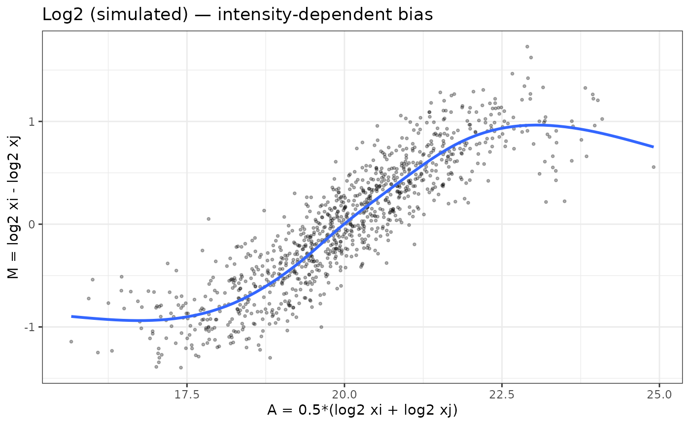
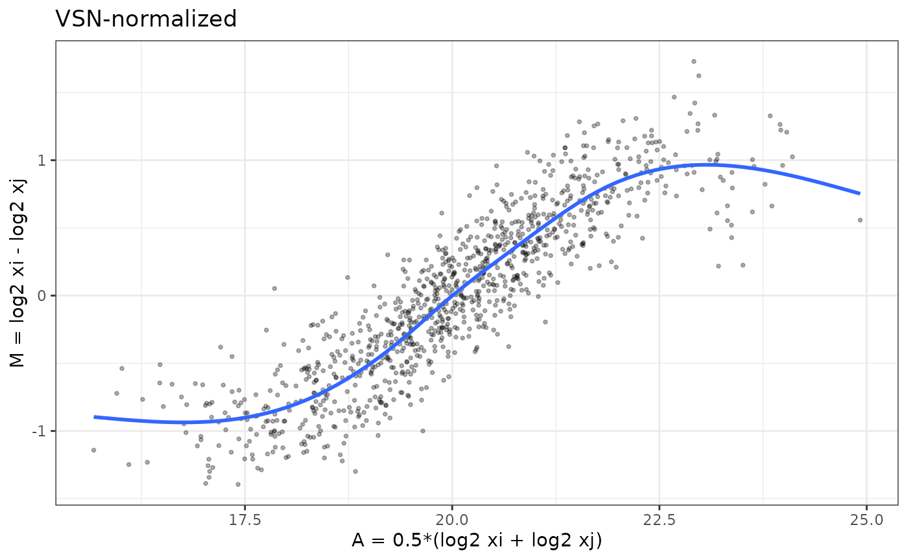
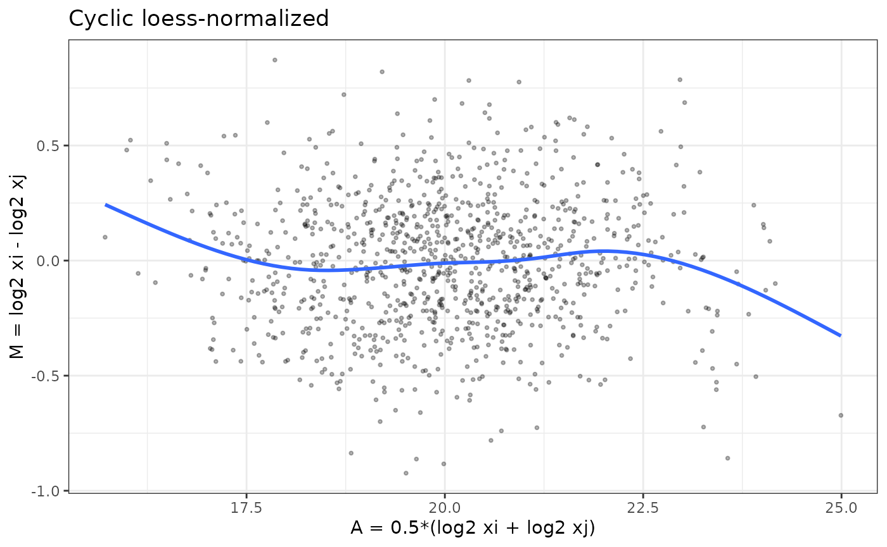
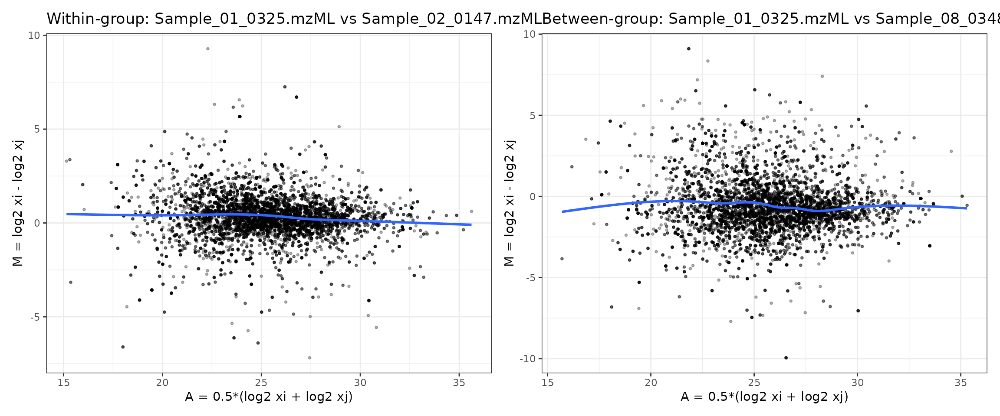

# proteoDA v2.0 Normalization and Imputation

## Introduction

Proteomics data are shaped by a mixture of biological signal and
technical variation introduced by sample preparation, instrument drift,
ionization efficiency, and missingness patterns.

Mass spectrometry intensities often show:

- Zeros and missing values (non-detects)
- Global scale differences between samples (loading / instrument drift)
- Intensity-dependent biases (curved M–A plots)
- Heteroscedasticity (variance depends on mean)

Before differential abundance analysis, it is crucial to:

1.  Handle zeros and missing values
2.  Select and evaluate a normalization method
3.  Decide whether imputation is required

`proteoDA v2.0` provides a structured workflow and built-in diagnostics
to help users make transparent normalization choices.

## Handling Missing Values and Zeros

### Why zero values must be treated carefully

In proteomics pipelines, zeros often represent **non-detected** features
rather than true zero abundance. Treating these zeros as real values
can:

- Artificially depress group means
- Inflate variance
- Produce exaggerated fold-changes

#### limma’s behavior:

By default, limma treats `NA` values in the expression matrix as missing
data. For each protein, `lmFit()`:

- Treats NA as missing values
- Excludes missing samples per protein
- fits the linear model using only the available intensities
- Compute correct residual degrees of freedom in `eBayes()`

Proteins can therefore have different numbers of samples. If an entire
group is missing, that coefficient/contrast becomes non-estimable and
limma returns `NA` for logFC and p-values. `eBayes()` uses the correct
residual degrees of freedom for each protein.

In contrast, numeric `zeros` are treated as real values. If zeros in the
input matrix actually represent “not detected” or “below detection
limit”, including them as true intensities can:

- Pull group means toward zero
- Inflate within-group variance
- Create exaggerated fold-changes when one group has many zeros and the
  other does not

Thus, it is preferable to convert zeros to `NA` before modeling.

#### Converting zeros to missing

`proteoDA` provides two helpers:

[`zero_to_missing()`](https://byrumlab.github.io/proteoDA/reference/missing_data.md)
— convert zeros (or other thresholded values) to NA before normalization
and modeling

[`missing_to_zero()`](https://byrumlab.github.io/proteoDA/reference/missing_data.md)
— optional post-analysis conversion. Used if a downstream tool requires
a fully numeric matrix, such as PCA.

``` r
library(proteoDA)
## Locate the Lou 2023 benchmark directory
# 1) Try the installed-package location (works after install/build_vignettes)
bench_dir <- system.file("extdata/lou2023_benchmark", package = "proteoDA")

# 2) During development with devtools::load_all(), system.file() may be ""
#    so fall back to the source tree: ../inst/extdata/lou2023_benchmark
if (bench_dir == "") {
  bench_dir <- normalizePath(
    file.path("..", "inst", "extdata", "lou2023_benchmark"),
    winslash = "/",
    mustWork = TRUE
  )
  message("Using local development benchmark directory: ", bench_dir)
}

# Sanity check
stopifnot(dir.exists(bench_dir))

# Override key input file paths to use the package system files
raw_file <- file.path(bench_dir,"raw.rds")
DAList_raw <- readRDS(raw_file)
str(DAList_raw)
```

    ## List of 7
    ##  $ data      :'data.frame':  9089 obs. of  17 variables:
    ##   ..$ Pool_1.mzML        : num [1:9089] 12128420 34858280 83996110 70885410 25028960 ...
    ##   ..$ Pool_2.mzML        : num [1:9089] 10100400 37054710 99612510 77754340 21329540 ...
    ##   ..$ Pool_3.mzML        : num [1:9089] 8.05e+06 3.93e+07 1.07e+08 7.68e+07 2.67e+07 ...
    ##   ..$ Sample_01_0325.mzML: num [1:9089] 6400703 88847090 42280640 73468270 59603060 ...
    ##   ..$ Sample_02_0147.mzML: num [1:9089] 9.80e+06 4.02e+07 1.79e+08 1.19e+08 1.86e+07 ...
    ##   ..$ Sample_03_4085.mzML: num [1:9089] 2.15e+06 3.98e+07 1.94e+08 4.55e+07 6.48e+06 ...
    ##   ..$ Sample_04_0039.mzML: num [1:9089] 767043 39975930 49979340 69640920 14402970 ...
    ##   ..$ Sample_05_5198.mzML: num [1:9089] 7872038 42115980 39133770 75263440 15958740 ...
    ##   ..$ Sample_06_7066.mzML: num [1:9089] 2.38e+06 2.47e+07 3.82e+07 1.03e+08 3.52e+07 ...
    ##   ..$ Sample_07_0909.mzML: num [1:9089] 14989790 23234440 24654850 71260680 19612370 ...
    ##   ..$ Sample_08_0348.mzML: num [1:9089] 17759460 1862563 16704030 60429110 77828310 ...
    ##   ..$ Sample_09_7028.mzML: num [1:9089] 9190121 28740020 51880990 83455310 36625060 ...
    ##   ..$ Sample_10_2119.mzML: num [1:9089] 1747821 9271566 22337610 27706830 5416264 ...
    ##   ..$ Sample_11_6501.mzML: num [1:9089] 7.34e+05 7.35e+07 4.19e+08 1.04e+08 1.75e+07 ...
    ##   ..$ Sample_12_9999.mzML: num [1:9089] 1.10e+06 4.04e+07 1.10e+08 5.53e+07 1.13e+07 ...
    ##   ..$ Sample_13_1014.mzML: num [1:9089] 12225410 35323730 74030230 67913170 22483620 ...
    ##   ..$ Sample_14_1059.mzML: num [1:9089] 11632510 14474530 72548530 87962450 18911320 ...
    ##  $ annotation:'data.frame':  9089 obs. of  4 variables:
    ##   ..$ uniprot_id      : chr [1:9089] "A0A087X1C5" "A0A0B4J1Y9" "A0A0C4DH29" "A0AVT1" ...
    ##   ..$ protein_info    : chr [1:9089] "sp|A0A087X1C5|CP2D7_HUMAN Putative cytochrome P450 2D7 OS=Homo sapiens OX=9606 GN=CYP2D7 PE=5 SV=1" "sp|A0A0B4J1Y9|HV372_HUMAN Immunoglobulin heavy variable 3-72 OS=Homo sapiens OX=9606 GN=IGHV3-72 PE=3 SV=1" "sp|A0A0C4DH29|HV103_HUMAN Immunoglobulin heavy variable 1-3 OS=Homo sapiens OX=9606 GN=IGHV1-3 PE=3 SV=1" "sp|A0AVT1|UBA6_HUMAN Ubiquitin-like modifier-activating enzyme 6 OS=Homo sapiens OX=9606 GN=UBA6 PE=1 SV=1" ...
    ##   ..$ accession_number: chr [1:9089] "sp|A0A087X1C5|CP2D7_HUMAN" "sp|A0A0B4J1Y9|HV372_HUMAN" "sp|A0A0C4DH29|HV103_HUMAN" "sp|A0AVT1|UBA6_HUMAN" ...
    ##   ..$ molecular_weight: chr [1:9089] "57 kDa" "13 kDa" "13 kDa" "118 kDa" ...
    ##  $ metadata  :'data.frame':  17 obs. of  4 variables:
    ##   ..$ data_column_name: chr [1:17] "Pool_1.mzML" "Pool_2.mzML" "Pool_3.mzML" "Sample_01_0325.mzML" ...
    ##   ..$ sample          : chr [1:17] "P1" "P2" "P3" "S325" ...
    ##   ..$ batch           : int [1:17] 1 1 1 1 1 1 1 1 1 1 ...
    ##   ..$ group           : chr [1:17] "Pool" "Pool" "Pool" "normal" ...
    ##  $ design    : NULL
    ##  $ eBayes_fit: NULL
    ##  $ results   : NULL
    ##  $ tags      : NULL
    ##  - attr(*, "class")= chr "DAList"

``` r
DAList_clean <- zero_to_missing(DAList_raw)

# Check results
head(DAList_clean$data[, 1:5])
```

    ##            Pool_1.mzML Pool_2.mzML Pool_3.mzML Sample_01_0325.mzML
    ## A0A087X1C5    12128420    10100400     8047184             6400703
    ## A0A0B4J1Y9    34858280    37054710    39324880            88847090
    ## A0A0C4DH29    83996110    99612510   107389100            42280640
    ## A0AVT1        70885410    77754340    76753210            73468270
    ## A0FGR8        25028960    21329540    26742190            59603060
    ## A0MZ66        10811940    11644230    10496870            20095690
    ##            Sample_02_0147.mzML
    ## A0A087X1C5             9803543
    ## A0A0B4J1Y9            40182130
    ## A0A0C4DH29           179020600
    ## A0AVT1               119136300
    ## A0FGR8                18563650
    ## A0MZ66                11457240

## Overview of Normalization Strategies in proteoDA v2.0

`proteoDA` implements eight complementary normalization approaches,
building on the evaluation framework from `proteiNorm` (Graw et al.,
2020, ACS Omega 5:25625–25633).

| Method                 | What_it_does                                            | Assumptions                                                 | Good_for                                                | Tag_in_DAList |
|:-----------------------|:--------------------------------------------------------|:------------------------------------------------------------|:--------------------------------------------------------|:--------------|
| log2                   | Log2 transform intensities                              | Logged intensities suitable for linear modeling             | Raw intensities needing log scale                       | log2          |
| median                 | Center per-sample by median (log2 scale)                | Most proteins not changing; median reflects scale           | Simple between-sample scaling                           | median        |
| mean                   | Center per-sample by mean (log2 scale)                  | Most proteins not changing; mean reflects scale             | Simple between-sample scaling                           | mean          |
| vsn                    | Variance stabilizing normalization (VSN)                | Suitable for heteroscedastic data / low intensities         | Wider dynamic ranges; many low-abundance proteins       | vsn           |
| quantile               | Force identical distributions across samples            | Most proteins not changing; distributional equality         | Strong global effects; label-free                       | quantile      |
| cycloess               | Cyclic loess (intensity-dependent bias correction)      | Smooth intensity-dependent bias between samples             | Nonlinear M–A trends; TMT / multi-batch                 | cycloess      |
| rlr                    | Robust linear normalization                             | Linear bias removable robustly                              | Outlier-prone samples                                   | rlr           |
| gi                     | Global intensity scaling (log2)                         | Samples comparable by total intensity; global scaling valid | Global load differences without strong intensity trends | gi            |
| external (e.g., DIANN) | Use upstream normalization; set DAList$tags$norm_method | Upstream method is appropriate/consistent                   | Pipelines like DIA-NN that already normalized           | diann_quan    |

Normalization strategies and when to use them

### Quick decision checklist

Use this to guide early choices:

- Already normalized upstream (e.g., Log2 median)? → Set
  `DAList$tags$norm_method` \<- “Log2_median” and skip re-normalizing.

- Clear global scaling differences, no strong intensity trend? →
  `median` or `mean`.

- Many low-abundance proteins, strong mean–variance dependence,
  zeros/near-zeros? → `vsn`.

- Want identical empirical distributions; assume most proteins
  unchanged? → `quantile`.

- Curved “smile/frown” patterns in M–A plots (intensity-dependent bias)?
  → `cycloess` (cyclic loess) or `rlr`.

- Single run with modest variation, mainly load differences? → `gi`
  (global intensity scaling).

- Highly distinct groups with clear biological effects? → avoid
  `quantile` (may suppress biology)

## Simulated Example: Detecting and Fixing Bias Using MA Plots

To make the diagnostics more concrete, we simulate a small
proteomics-like dataset with:

- 1000 proteins × 8 samples
- 2 conditions (4 vs 4)
- Mild true differential abundance in ~10% of proteins
- Nonlinear Intensity-dependent technical bias in two samples

Then we compare:

- Log2-transformed data
- VSN
- Cyclic loess

### Simulate data with bias

``` r
set.seed(123)

n_prot  <- 1000
n_samp  <- 8
group   <- rep(c("A","B"), each = 4)

# base mean on log2 scale

mu      <- rnorm(n_prot, mean = 20, sd = 1.5)

# true DE: 10% up in group B

is_de   <- rbinom(n_prot, 1, 0.1) == 1
lfc     <- ifelse(is_de, rnorm(n_prot, 1, 0.2), 0)

# construct log2 intensities with group effect + noise

log2_mat <- sapply(seq_len(n_samp), function(j) {
g <- group[j]
mu + (g == "B") * lfc + rnorm(n_prot, sd = 0.2)
})
colnames(log2_mat) <- paste0(group, "_", 1:4)
rownames(log2_mat) <- paste0("prot", 1:n_prot)

# add intensity-dependent bias to first 2 samples (e.g. bad run)

bias_fun <- function(x) 0.5 * sin((x - mean(x)) / 2)
log2_mat[,1] <- log2_mat[,1] + bias_fun(log2_mat[,1])
log2_mat[,2] <- log2_mat[,2] - bias_fun(log2_mat[,2])

# convert back to raw intensities for VSN

raw_mat <- 2^log2_mat
```

### M–A plot helper

``` r
ma_plot <- function(mat, i = 1, j = 2, main = "") {
x_i <- mat[, i]
x_j <- mat[, j]
A   <- 0.5 * (x_i + x_j)
M   <- x_i - x_j
df  <- data.frame(A = A, M = M)

ggplot(df, aes(x = A, y = M)) +
geom_point(alpha = 0.3, size = 0.7) +
geom_smooth(se = FALSE, span = 0.7) +
labs(x = "A = 0.5*(log2 xi + log2 xj)",
y = "M = log2 xi - log2 xj",
title = main) +
theme_bw()
}
```

### MA plot of Log2 data with bias

``` r
library(ggplot2)
ma_plot(log2_mat, 1, 2, main = "Log2 (simulated) — intensity-dependent bias")
```



The **“Log2 (simulated) — intensity-dependent bias”** shows an M–A plot
for the simulated data before normalization. The blue loess curve has a
strong “S-shaped” trend: low-intensity points are biased downward,
mid-intensity points upward, and the curve only flattens at the very top
of the dynamic range. This is exactly the kind of intensity-dependent
bias that can distort fold-changes and p-values if left uncorrected.

- The distinct S-shaped loess curve indicates nonlinear technical bias,
  the type addressed by cyclic loess.

## Comparing VSN and cyclic loess in simulated data

``` r
# VSN on raw intensities

vsn_fit <- vsn::justvsn(raw_mat)
# In the current vsn, justvsn() already returns the normalized matrix
log2_vsn <- vsn_fit

# cyclic loess on log2 data

log2_cyc <- limma::normalizeCyclicLoess(log2_mat, method = "fast")
```

### M–A plots after `VSN` and `cyclic loess` normalization

``` r
p_vsn <- ma_plot(log2_vsn, 1, 2, main = "VSN-normalized")
p_cyc <- ma_plot(log2_cyc, 1, 2, main = "Cyclic loess-normalized")

p_vsn
```



``` r
p_cyc
```



### Interpreting the VSN and cyclic loess normalized MA plots

The **VSN-normalized M–A plot** shows that variance has been stabilized
across the full intensity range, but intensity-dependent bias has not
been removed. The blue loess curve still follows the same “S-shaped”
trend seen before normalization—indicating that the underlying nonlinear
relationship between samples remains.

This behavior is expected: `VSN` is designed to stabilize variance,
particularly for low-intensity features where raw MS signals are
extremely noisy. It does not attempt to correct systematic, smooth,
sample-to-sample biases. As a result:

- The vertical spread of points is more uniform than in the raw or log2
  data.
- But the mean trend (blue line) still bends upward and downward with
  intensity.
- This confirms that `VSN` addresses heteroscedasticity, not nonlinear
  intensity-dependent bias.

In contrast, the **cyclic loess–normalized MA plot** shows a flat loess
line centered on `𝑀=0`, demonstrating that `cyclic loess` corrects the
shape of the M–A curve, whereas `VSN` corrects the variance of the
data.The point cloud is more symmetric and, most importantly, the blue
loess line is now nearly flat around `𝑀=0` across the whole A range.
This indicates that `cyclic loess` has successfully removed the smooth,
non-linear bias between these samples while preserving local
variability.

Together, these plots illustrate why `VSN` and `cyclic loess` solve
different problems and can lead to different normalization choices
depending on the characteristics of the dataset.

- `VSN` mainly stabilizes variance across intensities (points look more
  homoscedastic) but leaves nonlinear bias.
- `Cyclic loess` directly flattens the intensity-dependent curve (loess
  line ~ 0 across A).

## Evaluating Normalization Methods with `write_norm_report()`

In real data, you would inspect these plots across several sample pairs.
In practice you will start from a `DAList` created from real data.

Here we show the call; you can plug in your own object.

1.  convert `0` values to `NA` and generate the normalization report

``` r
# Assume DAList_raw is constructed from your peptide/protein matrix
# and sample metadata

# 1) Convert zeros to missing if needed

DAList_clean <- zero_to_missing(DAList_raw)

# 2) Run normalization evaluation with multiple methods

write_norm_report(
            DAList_clean,
grouping_col = "group",      # column in sample_metadata
output_dir   = "QC_norm_report",
filename     = "norm_eval.pdf",
overwrite    = TRUE
)
```

The report includes, for each method:

- Variance metrics (PCV, PEV, PMAD)
- Intragroup correlations and correlation heatmap
- Log2-ratio distributions
- Overlayed MA plots for all sample pairs → reveals global bias patterns
  quickly

### How to interpret variance and correlation metrics

Before looking at MA plots, it is helpful to use the variance and
correlation based diagnostics in the normalization report to decide
which methods are most promising.

#### Pooled variance metrics: PCV, PEV, PMAD

The report summarizes within-group variability using:

- **PCV (Pooled Coefficient of Variation)**
  - Lower PCV → tighter agreement among biological replicates.  
  - Compare methods: a good normalization should reduce PCV without
    collapsing biological differences.
- **PEV (Pooled Estimate of Variance)**
  - Reflects the average variance across proteins within groups.  
  - Methods that strongly change the overall scale (e.g. global
    intensity, quantile) may shift PEV.  
  - Look for methods that reduce PEV while still preserving a reasonable
    dynamic range.
- **PMAD (Pooled Median Absolute Deviation)**
  - Robust alternative to PEV, less sensitive to outliers.  
  - Lower PMAD indicates more consistent replicate measurements.  
  - When PCV and PMAD agree, the ranking of methods is usually reliable.

In general, better normalized data will show lower PCV/PEV/PMAD for
biological replicates compared to the unnormalized or log2-only
versions.

#### Correlation metrics and heatmaps

The report also includes:

- **Intragroup correlation**
  - Distribution of Pearson correlations between samples within the
    *same* group.  
  - Higher intragroup correlations indicate more consistent replicate
    profiles.  
  - Compare medians across methods: good normalization should increase
    intragroup correlation.
- **Intergroup vs intragroup separation**
  - If intergroup correlations are similar to intragroup correlations,
    biological groups may not be well separated.
  - A useful normalization improves replicate agreement *without* making
    all samples look identical.
- **Correlation heatmap**
  - Shows the full sample–sample correlation matrix.  
  - Look for:
    - Replicates clustering together by biological group  
    - Absence of strong batch-driven blocks  
    - No obvious outlier samples with uniformly low correlation

Together, the variance and correlation diagnostics highlight which
methods best stabilize replicate measurements and preserve group
structure. The overlayed MA plots then provide a complementary view
focused specifically on intensity-dependent bias.

### How to interpret overlayed MA plots

- Flat loess lines → no intensity-dependent bias
- Symmetric clouds around zero → good normalization
- Curvature → nonlinear bias remains
- Overly tight clustering → over-normalization (e.g., quantile)
- Overlayed MA plots provide a holistic QC view across all samples.

### Understanding the Overlaid MA Plots in the Normalization Report

The MA plots shown in the normalization report summarize all pairwise
comparisons of samples within the dataset for each normalization method.
Instead of visualizing one M–A plot at a time, the report overlays the
M–A points from every sample pair into a single panel per method.

This produces a compact view of the overall bias structure across the
experiment and allows for quick visual comparison of methods.

#### Why overlay all sample pairs?

Overlaying all pairwise MA plots is useful because: - It reveals global
patterns that may not be obvious from a single sample comparison. - If a
normalization method leaves intensity-dependent bias, you will see a
curved or tilted trend across the cloud of points. - If a method causes
over-normalization, the biological separation between groups may
collapse, producing an unnaturally tight cluster around zero. -
Consistently centered and homoscedastic MA clouds indicate that the
method effectively removes technical differences while preserving real
variation.

#### How to read these panels

Each point represents the log fold-change 𝑀 vs. the mean intensity𝐴for
one protein, for one sample pair. Because all sample pairs are plotted
together:

- A well-normalized dataset produces a dense, symmetric cloud of points
  centered around `𝑀=0`.
- The loess curve (orange) should be flat, indicating no systematic
  intensity-dependent shifts across samples.
- Methods that fail to remove bias will show:
  - upward or downward drift in the loess curve
  - curvature (“smile” or “frown”)
  - systematic tilting
- Methods that overcorrect may artificially pull points toward 𝑀=0,
  erasing biological differences.

In the example shown above:

- `log2`, `median`, `mean`, `vsn`, `rlr`, and `gi` all produce
  relatively symmetric MA clouds.
- `quantile` can appear tighter because it forces identical
  distributions, which can suppress biological variation.
- `cyclic loess` specifically targets intensity-dependent trends, but if
  such trends are weak, as in this dataset, the MA structure will look
  similar across methods.

#### Why this is more informative than a single MA plot

A single pairwise MA plot only reflects the relationship between two
samples, which may look acceptable even when other sample pairs contain
strong biases. Overlaying all pairs simultaneously provides a holistic
quality check that ensures:

- consistency across the entire dataset
- appropriate scaling in all samples
- no sample-specific distortions that would impact downstream modeling

This approach mirrors what is commonly done in microarray QC pipelines
(e.g., limma, affy, and vsn workflows), adapted here for proteomics.

### Optional: Creating your own MA plots with ma_plot()

The vignette defines and exports an M-A plot helper function:

``` r
ma_plot(mat, i, j, main = "")

# example
ma_plot(expr_log2, i = 1, j = 2, main = "Within-group comparison")
ma_plot(expr_log2, i = 1, j = 8, main = "Normal vs Cancer")
```

Users can apply ma_plot() to:

- inspect specific sample pairs
- investigate outlier samples
- confirm normalization effects on key comparisons
- visualize differences between biological groups

This gives users flexibility beyond the aggregated report, while the
overlaid MA plots in the normalization report provide a global view of
method performance.

## Real Data Example: Within-Group vs Between-Group MA Plots

To understand how normalization interacts with the biology of the
dataset, it is useful to visually compare:

- an **MA plot of two samples from the same biological group**, and  
- an **MA plot of one normal vs one cancer sample**.

These two situations reveal very different structures and help guide
which normalization approach is appropriate. Since you now have real
data in `DAList_raw$data`, you can create MA plots directly.

- proteoDA does not assume data are log2 by default
- MA plots require log2 intensities
- Without log2, M–A shapes become meaningless (because M ≠ log ratio)
- The code below checks the scale, transforms as needed, prevents
  `-Inf`, and produces a valid MA plot.

``` r
# 1) Load DAList_raw from raw.rds (example shown) if not already loaded above
# raw_file <- system.file("extdata", "raw.rds", package = "proteoDA")
# DAList_raw <- readRDS(raw_file)

# Ensure log2 scale for real data
expr_raw <- as.matrix(DAList_raw$data)

if (max(expr_raw, na.rm = TRUE) > 200) {
  expr_log2 <- log2(expr_raw)
} else {
  expr_log2 <- expr_raw
}
expr_log2[!is.finite(expr_log2)] <- NA

# Identify sample columns (replace with your actual column names if needed)
# 4-10 = normal
# 11-17 = cancer
s_within_1 <- colnames(expr_log2)[4]   # within-group example, sample 1
s_within_2 <- colnames(expr_log2)[5]   # within-group example, sample 2

s_between_1 <- colnames(expr_log2)[4]  # normal sample
s_between_2 <- colnames(expr_log2)[11]  # cancer sample (example)

# Generate both MA plots
p_within  <- ma_plot(expr_log2,
                     i = which(colnames(expr_log2) == s_within_1),
                     j = which(colnames(expr_log2) == s_within_2),
                     main = paste("Within-group:", s_within_1, "vs", s_within_2))

p_between <- ma_plot(expr_log2,
                     i = which(colnames(expr_log2) == s_between_1),
                     j = which(colnames(expr_log2) == s_between_2),
                     main = paste("Between-group:", s_between_1, "vs", s_between_2))

# Display side-by-side
library(patchwork)
p_within + p_between
```



### How to interpret these MA plots

#### Left panel (within-group comparison)

Comparing two samples from the same group (“normal”) using the MA plot
from `raw.rds` illustrates what we typically hope to see in well-behaved
experimental data: most points cluster around `𝑀= 0` with no obvious
curvature in the mean trend. Small deviations are expected, but the
absence of a strong “smile” or “frown” pattern suggests that large
intensity-dependent biases are not present (or have already been
corrected by the chosen normalization).

- The cloud of points is tightly centered around `M = 0`.
- No major global fold-change shift
- The loess trend is flat, showing no systematic drift across
  intensities.
- Variability is largely symmetric.
- No strong intensity-dependent bias, since the blue loess curve is
  nearly flat with only minor deviations.

This indicates that technical variation dominates, and there is no major
intensity-dependent bias between replicates. `Cyclic loess` is not
needed here. A small number of points fall outside the main band,
reflecting genuine biological variation or low-intensity noise typical
of mass spectrometry data. The warnings at the top simply note that a
handful of missing or non-finite values were removed before smoothing,
which is expected in real proteomics datasets.

Overall, this MA plot suggests that the raw data are reasonably
well-behaved and that no severe nonlinear relationship exists between
these two samples—unlike the simulated example where polarization and
curvature were evident. It provides a baseline for evaluating whether
normalization further improves sample comparability.

#### Right panel (between-group comparison)

In contrast to the within-group comparison, the MA plot comparing a
normal sample to a cancer sample shows a clear shift in the distribution
of log2 fold-changes (M). Although the blue loess curve remains
relatively flat—indicating no strong intensity-dependent technical
bias—the cloud of points is more vertically dispersed and shows
systematic deviations from zero across the intensity range.

This pattern reflects true biological differences between the two
conditions rather than normalization artifacts. Cancer samples often
exhibit coordinated up- or down-regulation of many proteins, and this
manifests as:

- A broader spread of M-values (greater biological variability),
- Many points diverge from zero, indicating true biological differences
  between normal and cancer samples.
- A slight upward or downward offset in the loess line depending on
  global trends in the biology.

Importantly, the absence of curvature confirms that the comparison is
not dominated by technical intensity-dependent effects. Instead, the
systematic differences seen here represent the expected biological
signal that differential abundance analysis aims to quantify, and
normalization should preserve these differences rather than eliminate
them.

#### What does this imply for normalization?

- `VSN` is well suited here because it stabilizes variance while
  preserving biological fold-changes.
- `Median` normalization is a lighter alternative if only global scaling
  needs adjustment.
- `Cyclic loess` normalization is unnecessary unless the loess curve
  shows intensity-dependent curvature—which it does not in this dataset.
- `Quantile` normalization may distort biology in datasets with strong
  condition effects and is not recommended.

Overall, the side-by-side comparisons show that this dataset is
biologically different between groups but not technically biased across
intensities. Thus, `VSN` or `median` normalization are the most
appropriate choices.

#### Choosing a normalization method for this dataset

By comparing both MA plots—the **within-group** comparison (Sample_01 vs
Sample_02) and the **between-group** comparison (Normal vs Cancer)—we
can decide which normalization strategies are appropriate for this
dataset.

##### Within-group MA plot (Sample_01 vs Sample_02)

- The point cloud is centered close to **M = 0**.
- The blue loess curve is **flat** across the full A range.
- There is no obvious “smile” or “frown” shape.
- Variance is relatively symmetric at low and high intensities.

**Interpretation:**  
There is **no major nonlinear technical bias** between these biological
replicates. Cyclic loess is *not required* here to correct
intensity-dependent effects.

##### Between-group MA plot (Normal vs Cancer)

- The M-values show **greater vertical spread**, as expected for two
  different biological conditions.
- Many points are far from zero, indicating **differentially abundant
  proteins**.
- The loess curve remains **approximately flat** with only minor
  deviations.
- No strong curvature is present.

**Interpretation:**  
The additional spread reflects **true biological differences** between
normal and cancer, not a technical artifact. A good normalization method
should **preserve** this structure rather than forcing the distributions
to look the same.

------------------------------------------------------------------------

#### VSN (Variance Stabilizing Normalization)

VSN is designed to stabilize variance across the full intensity range,
especially for **low-abundance, noisy proteins**, without imposing
strong assumptions about the shape of the M–A curve.

Given these MA plots:

- There is **no strong intensity-dependent bias** to remove.
- But there is **substantial heteroscedasticity**, with more scatter at
  lower intensities.

**Conclusion:**  
VSN is a **strong choice** for this dataset. It stabilizes variance and
improves downstream modeling while leaving the essentially flat mean
trend (no nonlinear bias) intact and preserving the biological
differences between normal and cancer.

#### Median / Mean normalization

Median and mean normalization perform simple **global scaling**:

- They align sample medians or means.
- They are appropriate when **loading / global scale** differs modestly
  but there is no nonlinear distortion.

Here, the MA plots suggest:

- Samples are already reasonably centered around $M = 0$.
- Any remaining differences are mostly biological rather than global
  scaling.

**Conclusion:**  
Median normalization is a reasonable **lightweight alternative** if a
simple global adjustment is desired and the dataset does not show strong
mean–variance issues.

#### Cyclic loess

`Cyclic loess` is specifically designed to remove **smooth,
intensity-dependent biases** (curved M–A trends).

In this dataset:

- Neither the `within-group` nor `between-group` MA plots show strong
  curvature.
- The loess line is essentially flat, so there is no clear nonlinear
  relationship to correct.

**Conclusion:**  
`Cyclic loess` is **not necessary** here and could over-correct if
applied aggressively, potentially shrinking real biological differences.

#### Quantile normalization

`Quantile` normalization forces all samples to have **identical
intensity distributions**. This is powerful but aggressive, and can:

- Remove global technical biases **and**
- Suppress or distort real biological differences when those differences
  affect many proteins.

Because the normal vs cancer MA plot shows substantial biological
separation:

**Conclusion:**  
`Quantile` normalization is **not recommended** for this dataset, as it
risks flattening the very signal (systematic proteome shifts) that we
want to detect.

------------------------------------------------------------------------

### Summary for this dataset

- The MA plots show **no major intensity-dependent bias**, but they do
  show **biological differences** between conditions.
- Therefore:
  - **Recommended:** `vsn` (for variance stabilization) or `median` (for
    simple scale adjustment).
  - **Use with caution / generally avoid here:** `cycloess` (no strong
    nonlinear bias to fix) and `quantile` (may distort real biology).

This aligns with the earlier decision framework:  
- **VSN** fixes **unequal variance across intensities**,  
- **Cyclic loess** fixes **nonlinear intensity-dependent bias**, which
your real dataset does not strongly exhibit.

## Normalization methods in `proteoDA v2.0` (implementation)

### Input expectations and behavior

| Method   | Input scale (expected) | Uses `groups=` | Output scale | Notes                                                                                  |
|:---------|:-----------------------|:---------------|:-------------|:---------------------------------------------------------------------------------------|
| log2     | raw                    | no             | log2         | Simple log2 transform; -Inf → NA preserved                                             |
| median   | log2                   | no             | log2         | Per-sample median scaling, rescaled to mean of medians                                 |
| mean     | log2                   | no             | log2         | Per-sample mean scaling, rescaled to mean of means                                     |
| quantile | log2                   | no             | log2         | Quantile normalization across all samples                                              |
| vsn      | raw                    | no             | log2-like    | vsn::justvsn variance-stabilizing normalization                                        |
| cycloess | log2                   | optional       | log2         | Cyclic loess (limma::normalizeCyclicLoess); if groups supplied, normalize within group |
| rlr      | log2                   | no             | log2         | Robust linear regression against row medians                                           |
| gi       | raw                    | no             | log2         | Global intensity scaling (divide by column sums, then log2)                            |

Input expectations and behavior for normalization methods in proteoDA
v2.0

### How to run proteoDA `normalize_data()` now the best method has been evaluated

In `proteoDA v2.0`:

- If `DAList$data_per_contrast` exists (e.g. after
  [`filter_proteins_per_contrast()`](https://byrumlab.github.io/proteoDA/reference/filter_proteins_per_contrast.md)),
  normalization is performed per contrast and written to
  `DAList$data_per_contrast[[contrast]]`, leaving `DAList$data`
  unchanged.
- Otherwise normalization is applied to `DAList$data`.

You can then pick a method (often `VSN` or `cyclic loess`) and apply it
with
[`normalize_data()`](https://byrumlab.github.io/proteoDA/reference/normalize_data.md).

- Available methods include: `log2`, `median`, `mean`, `vsn`,
  `quantile`, `cycloess`, `rlr`, `gi`

``` r
# VSN
DAList_norm <- normalize_data(
        DAList_clean,
norm_method   = "vsn",
input_is_log2 = FALSE,   # if the data has been log2 transformed, set to TRUE
use_per_contrast_if_available = TRUE  # did you run filter_proteins_per_contrasts? 
)

# cyclic loess with group defined; default uses global method if group is not defined
DAList_norm <- normalize_data(
        DAList_clean,
norm_method   = "cycloess",
input_is_log2 = FALSE,
groups        = DAList_clean$metadata$group,  # only used for cyclic loess for within group normalization, 
use_per_contrast_if_available = TRUE
)
```

------------------------------------------------------------------------

## Perseus-style MNAR imputation (perseus_impute())

Missing values in label-free proteomics are often missing not at random
(MNAR) due to low-abundance peptides that fall below the detection
limit. proteoDA implements a Perseus-like left-censoring strategy via
the
[`perseus_impute()`](https://byrumlab.github.io/proteoDA/reference/perseus_impute.md)
function, which operates on log2-transformed intensities.

``` r
# Perseus-style imputation on a normalized DAList
imputed <- perseus_impute(
  norm,
  shift              = 1.8,
  width              = 0.3,
  robust             = TRUE,
  min_obs_per_sample = 5,
  seed               = 1,
  save_before_after  = TRUE
)
```

### How the method works

For each sample (column) in the log2 intensity matrix:

1.  Let $x_{ij}$ be the observed log2 intensity for feature $i$ in
    sample $j$.
2.  From the **non-missing** values in sample $j$, estimate:
    - a location parameter $\mu_{j}$ (mean or median),
    - a scale parameter $\sigma_{j}$ (standard deviation or MAD).
3.  For every **missing** entry in that sample, draw a replacement value
    from a *downshifted Gaussian*:
    $$x_{ij}^{\text{imp}} \sim \mathcal{N}\left( \mu_{j} - \texttt{𝚜𝚑𝚒𝚏𝚝} \cdot \sigma_{j},\;\left( \texttt{𝚠𝚒𝚍𝚝𝚑} \cdot \sigma_{j} \right)^{2} \right).$$
4.  Rows that are missing in **all** samples remain `NA` (uninformative
    features).

This produces a small “shoulder” of imputed values at the low-intensity
end of the distribution, mimicking undetected low-abundance peptides
rather than inventing high-intensity signals.

### Key parameters

The main tuning parameters for
[`perseus_impute()`](https://byrumlab.github.io/proteoDA/reference/perseus_impute.md)
are:

- **`shift`** (default `1.8`)  
  Controls how far the imputed distribution is shifted *down* from the
  observed mean in units of the sample’s standard deviation.

  - Larger values → imputed values further to the left (lower
    intensity).  
  - Smaller values → imputed values closer to the main signal region.

- **`width`** (default `0.3`)  
  Scales the standard deviation of the imputed distribution:  
  $$\sigma_{\text{imp},j} = \texttt{𝚠𝚒𝚍𝚝𝚑} \cdot \sigma_{j}.$$

  - Smaller values → a narrow band of imputed values.  
  - Larger values → imputed values more spread out.

- **`robust`** (default `TRUE`)  
  Chooses whether to estimate the per-sample distribution using:

  - `TRUE`: **median** and **MAD** (robust to outliers), or  
  - `FALSE`: **mean** and **SD** (classic Perseus behaviour).

- **`min_obs_per_sample`** (default `5`)  
  Minimum number of observed (non-missing) log2 values required in a
  sample before estimating its own $\mu_{j}$ and $\sigma_{j}$.  
  If a sample has fewer than this many observations,
  [`perseus_impute()`](https://byrumlab.github.io/proteoDA/reference/perseus_impute.md)
  falls back to a **pooled distribution**:

  - $\mu_{\text{pooled}}$, $\sigma_{\text{pooled}}$ are computed from
    all observed values across all samples.
  - This prevents unstable per-sample estimates when a column is almost
    entirely missing.

- **`seed`** (default `NULL`)  
  Optional random seed for reproducible imputation. Set this to a fixed
  integer (e.g. `seed = 1`) to obtain identical imputed values across
  runs.

- **`save_before_after`** (default `FALSE`)  
  When `TRUE` and the input is a `DAList`, the function stores for each
  contrast:

  - `before_log2`: matrix of log2 intensities *before* imputation,  
  - `after_log2`: matrix *after* imputation,  
  - `imputed_mask`: logical matrix indicating which entries were
    imputed.  
    These diagnostics are written to
    `DAList$imputation_per_contrast[[contrast]]` and are used by the
    plotting function below.

- **`store_mask`** (default `TRUE`)  
  Controls whether the logical mask of imputed entries is stored. This
  is mainly useful for advanced diagnostics or downstream sensitivity
  analyses.

::: **Important:**
[`perseus_impute()`](https://byrumlab.github.io/proteoDA/reference/perseus_impute.md)
assumes that the input data are **log2-transformed**.  
As a safety check, the function issues a warning if the maximum absolute
value in a matrix is very large (e.g., `> 1e3`), which typically
indicates raw intensities rather than log2 values. :::

------------------------------------------------------------------------

### Per-contrast behavior with `DAList`

When the input is a `DAList`,
[`perseus_impute()`](https://byrumlab.github.io/proteoDA/reference/perseus_impute.md)
behaves as follows:

- If `DAList$data_per_contrast` exists and contains matrices for each
  contrast, imputation is performed **per contrast** and the imputed
  matrices are written back to `DAList$data_per_contrast[[contrast]]`.
- If `data_per_contrast` is absent, the function falls back to imputing
  the global matrix in `DAList$data`.

In both cases, if `save_before_after = TRUE`, the diagnostic matrices
are stored in:

``` r
DAList$imputation_per_contrast[[contrast]]$before_log2
DAList$imputation_per_contrast[[contrast]]$after_log2
DAList$imputation_per_contrast[[contrast]]$imputed_mask
```

These diagnostics are then visualized using the
[`write_perseus_imputation_plots()`](https://byrumlab.github.io/proteoDA/reference/write_perseus_imputation_plots.md)
helper.

------------------------------------------------------------------------

## Visualizing the imputation (write_perseus_imputation_plots())

To verify that Perseus-style imputation behaved as expected, proteoDA
provides
[`write_perseus_imputation_plots()`](https://byrumlab.github.io/proteoDA/reference/write_perseus_imputation_plots.md),
which creates faceted histograms comparing observed and imputed log2
intensities for each sample.

``` r
plots <- write_perseus_imputation_plots(
  DAList     = imputed,
  out_dir    = "PerseusPlots",
  contrasts  = NULL,   # or a subset of contrast names
  samples    = NULL,   # or a subset of sample IDs
  bins       = 30,
  facet_ncol = 4,
  overlay    = TRUE
)

# List available contrasts for which imputation plots were generated
names(plots)

# Inspect one contrast interactively
plots[["M1Y1_vs_Ref"]]
#or
plots[[1]] # first contrast
```

For each requested contrast, the function:

1.  Retrieves `before_log2` and `after_log2` from  
    `DAList$imputation_per_contrast[[contrast]]`.
2.  Reshapes them into a long format with indicators for:
    - sample ID,  
    - intensity value,  
    - status (Observed vs Imputed).
3.  Draws histograms per sample, faceted across all samples in the
    contrast.

### Plot parameters

- **`contrasts`**  
  Character vector of contrast names to plot. Defaults to all contrasts
  that have imputation diagnostics.

- **`samples`**  
  Optional subset of sample columns (names or indices). By default, all
  samples in the contrast are shown.

- **`bins`** (default `50`)  
  Number of histogram bins. Larger values give finer resolution but
  noisier counts.

- **`facet_ncol`** (default `4`)  
  Number of columns in the facet layout (how many samples per row).

- **`overlay`** (default `TRUE`)

  - `TRUE`: observed and imputed values are drawn in the same panel with
    different fill colors.  
  - `FALSE`: alternative stacking behaviour (if implemented in
    [`plot_perseus_imputation()`](https://byrumlab.github.io/proteoDA/reference/plot_perseus_imputation.md)).

- **`out_dir`**, **`width`**, **`height`**, **`dpi`**, **`device`**  
  Control where the plots are saved and in what format (e.g. `"png"` or
  `"pdf"`).  
  Even when writing to disk, the function invisibly returns a list of
  `ggplot` objects for interactive inspection.

### How to read the plots

In well-behaved imputations:

- The **blue** histogram (Observed) represents the main distribution of
  log2 intensities (e.g., ~15–30).  
- The **red** histogram (Imputed) appears as a smaller bump at the lower
  end of the distribution (e.g., ~10–15), reflecting low-abundance,
  undetected features.
- The imputed region should be clearly separated from the central bulk
  of the observed distribution.  
  If red and blue overlap heavily, the shift/width parameters may be too
  conservative.

These diagnostics complement the normalization evaluation plots by
confirming that:

- Imputation occurs on **normalized log2 intensities**, and  
- Missing values are replaced by **plausible low-intensity values**
  rather than unrealistic or overly influential ones.
