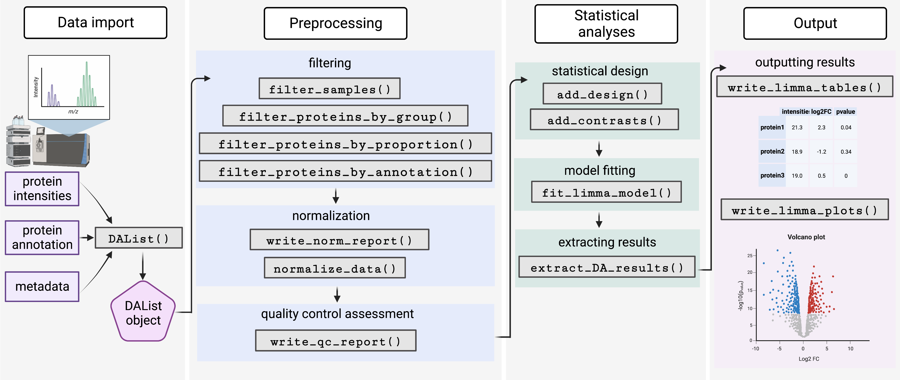

# Summary
`proteoDA` is an R package designed to analyze high resolution intensity-based mass spectrometry data. `proteoDA` was designed to be streamlined and user-friendly. `proteoDA` is built around a `DAList`, a custom R class, which is used to hold the data, statistical design, and results for a differential abundance analysis. Users import protein abundance data, protein annotation data, and sample metadata into a `DAList`, and all further functions operate on that list. Once the data are in `DAList`, `proteoDA` provides functions for further steps of the analysis \autoref{fig:workflow}. 

`proteoDA` includes functions for 1) evaluation of multiple normalization methods using a graphical report based on the `proteiNorm` normalization tool [@Graw2021; @Chawade2014], 2) generation of graphical quality control reports to assess data quality and sample clustering, 3) flexible specification and fitting of differential abundance models (including mixed models), using the R package `limma` to perform model fitting [@Ritchie2015; @Law2020], and 4) generation of tabular results files, as well as interactive and portable HTML result files, using the R package `Glimma` [@Su2017]. Please see the ByrumLab/proteoDA/vignettes/tutorial.html for more details. 

 

`proteoDA` provides all the functions necessary to evaluate the quality, remove unwanted samples, filter proteins with missing values, normalize the data, perform statistical analysis, and export the results into an interactive HTML report. 

# State of the field

Quantitative proteomics analysis is growing in popularity with the advancement of mass spectrometer instrumentation and software that allows for the identification of more and more proteins from complex sample mixtures [@Arora2019; @Deutsch2023; @Perez-Riverol2022]. Sequencing depths have increased from a few thousand to 10,000 proteins commonly identified from discovery experiments. Most proteomics mass spectrometry workflows follow the shotgun or bottom-up approach [@Tariq2021] in which a mixture of proteins is digested by an enzyme into peptides and then analyzed by LC MS/MS. Expertise in sample preparation, mass spectrometer parameters, experimental study designs, biostatistics, and programming languages are all needed in order to properly analyze and interpret proteomics data. ProteoDA was designed to make the process of analyzing bottom-up MS intensity-based data streamlined with flexible model designs. The functions in proteoDA allow a practical approach [@Schessner2022] for the evaluation of normalization methods, easy selection of limma model designs to account for batch effects or other factors, and interactive visualization of the results.

# Statement of need

`proteoDA` was designed to help researchers with minimal knowledge of R extract insights from proteomics data. `proteoDA` allows users to quickly assess the quality of a mass spectrometry experiment, normalize the data, control for batch effects, and define flexible linear model designs for a wide variety of proteomic experiments. In addition to providing quantitative analysis for experiments, `proteoDA` is widely used in the classroom as well as the IDeA National Resource for Quantitative Proteomics workshops for faculty and students. The package is robust but flexible to account for a wide variety of proteomics experiments and provides a training tutorial explaining normalization and linear model designs. 

# Acknowledgements

The development of this R package was supported by the National Institutes of Health National Institute of General Medical Sciences (NIH/NIGMS) grants P20GM121293, R24GM137786, the National Science Foundation Award No. OIA-1946391, and the UAMS Winthrop P. Rockefeller Cancer Institute. 

# References
