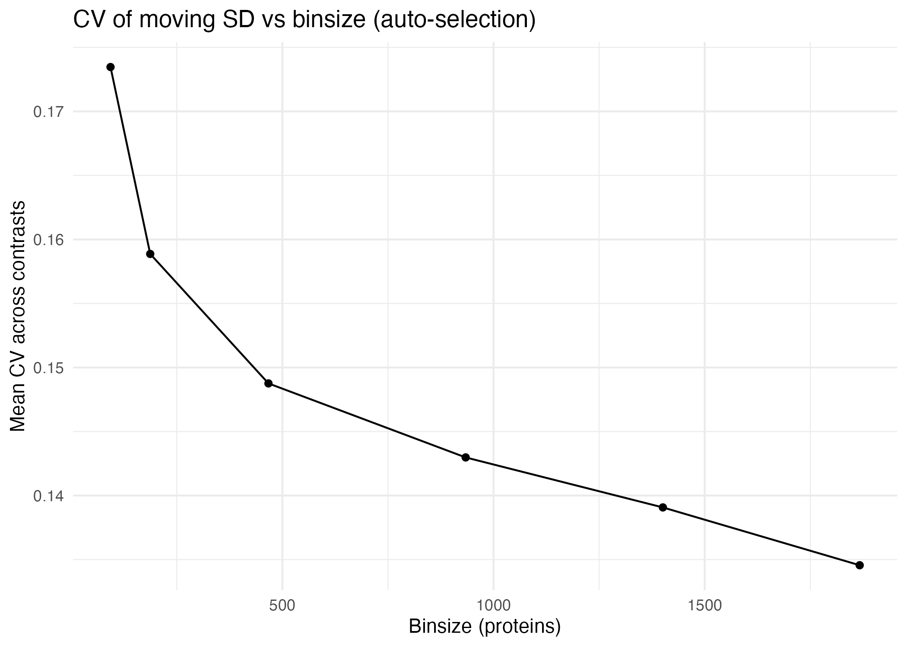
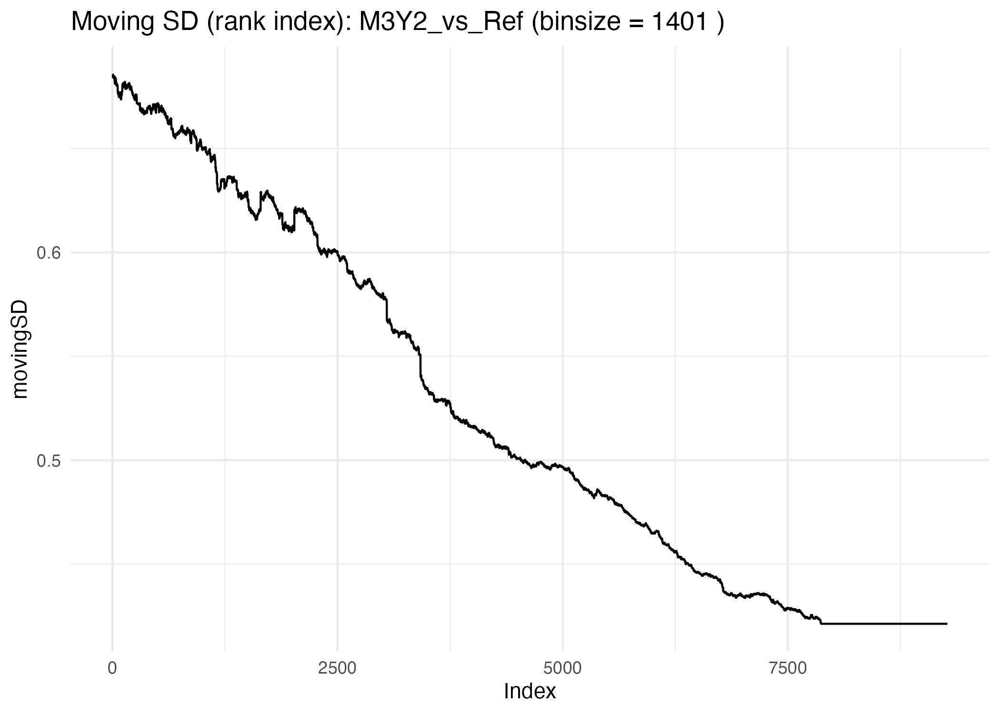
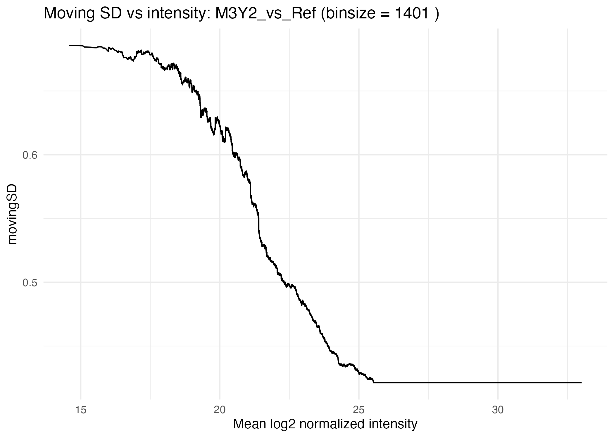
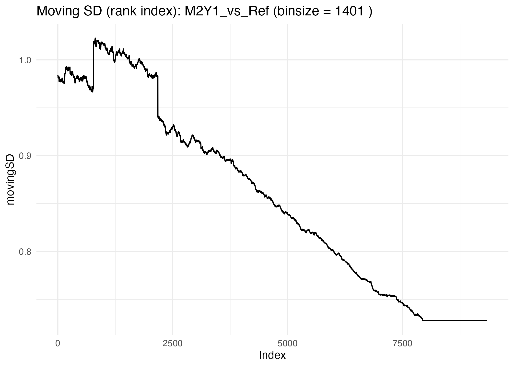
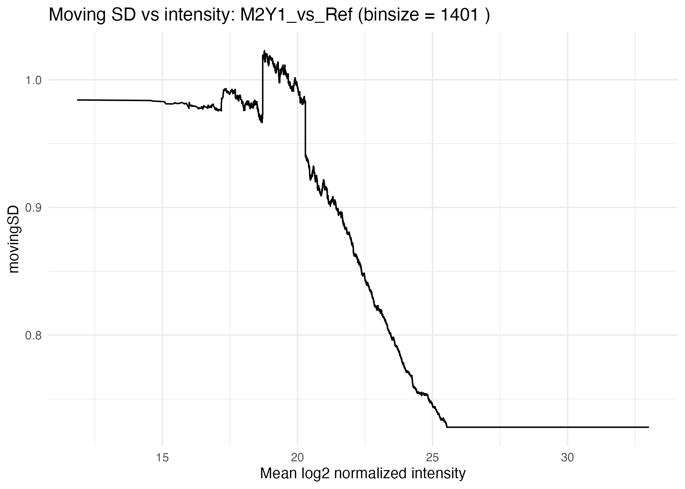
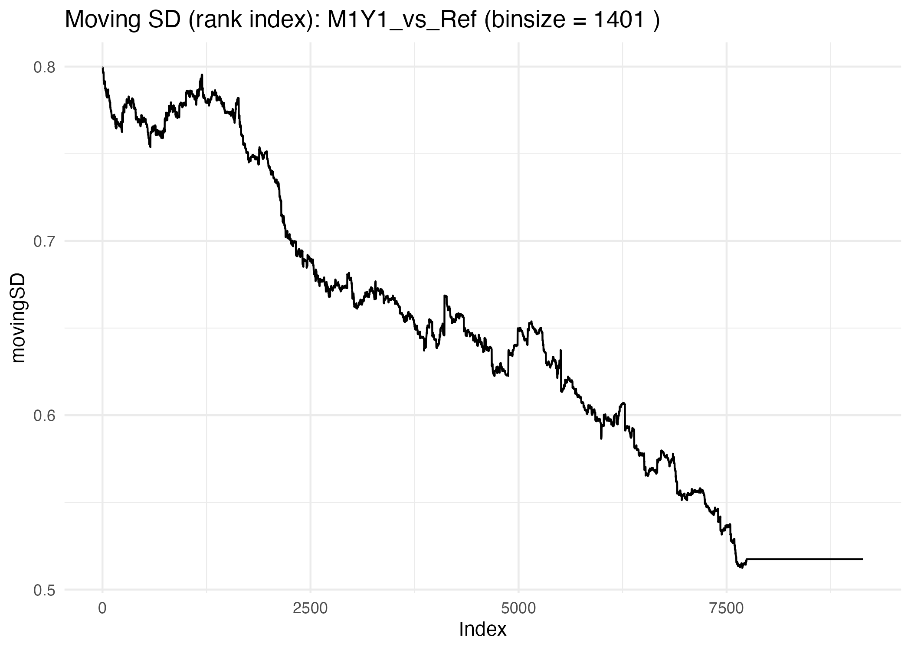
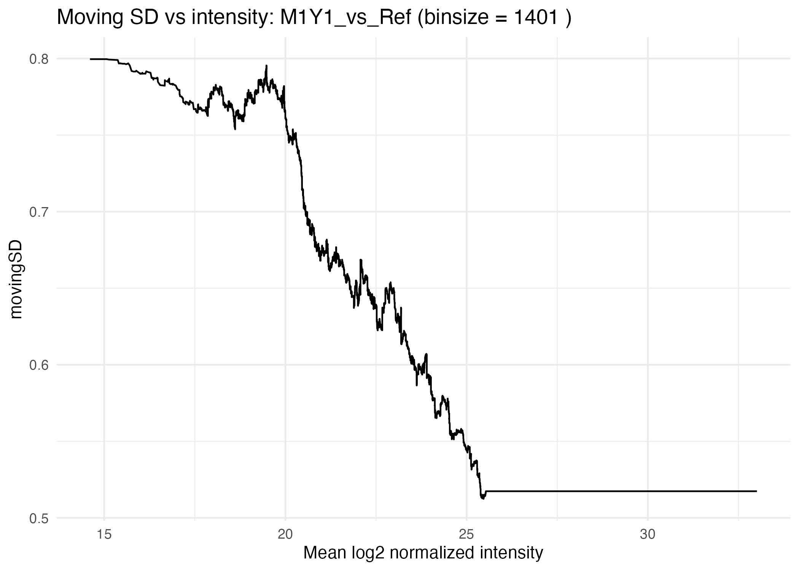

```{r setup, include=FALSE, eval=FALSE}
knitr::opts_chunk$set(echo = TRUE)
```

# Introduction

This vignette provides a practical guide to specifying statistical designs and
contrasts in proteoDA v2.0, with a focus on using the limma linear modeling
framework for differential protein abundance analysis.

Mass-spectrometry–based proteomics experiments vary widely in complexity:
some involve simple two-group comparisons, while others incorporate batch
effects, repeated measures, paired samples, or multi-factor biological designs.
proteoDA builds on limma’s modeling flexibility and provides a streamlined
interface for constructing design matrices, managing contrasts, and fitting
models to per-contrast filtered data.

For users who want a deeper background on limma model specification, we refer to
the excellent guide by Law et al. (2020):

> Law CW, Zeglinski K, Dong X, Alhamdoosh M, Smyth GK, Ritchie ME.
> A guide to creating design matrices for gene expression experiments.
> F1000Res. 2020;9:1444. doi:10.12688/f1000research.27893.1

This article provides clear illustrations of intercept vs. no-intercept
parameterizations, factorial designs, blocking, and interaction models—
all concepts directly applicable to proteomics and used throughout this vignette.

In this vignette, we illustrate:

- how to specify one-factor models with and without an intercept
(e.g., ~ 0 + group vs. ~ group);

- how to incorporate batch effects or additional covariates
(e.g., ~ 0 + group + batch);

- how to fit factorial models and interpret interaction terms
(e.g., ~ celltype * treatment);

- how to handle paired samples or repeated measures using
limma’s duplicateCorrelation as an approximate mixed-effects approach;

- how to construct contrasts that match the model matrix and test
biologically meaningful hypotheses;

- how proteoDA uses moving standard deviation (movingSD) and
logFC Z-scores to account for intensity-dependent variance when
interpreting statistical thresholds.

Other aspects of the workflow are described in separate vignettes:

1. **proteoDA_v1.0_workflow.Rmd** – original published workflow
2. **proteoDA_v2.0_workflow.Rmd** – DIANN → proteoDA v2.0 workflow
3. **proteoDA_v2.0_PreProcessing.Rmd** – filtering, technical replicates, QC
4. **proteoDA_v2.0_Norm.Rmd** – normalization strategies and evaluation
5. **proteoDA_v2.0_design.Rmd** – this vignette: designs, contrasts, thresholds
6. **proteoDA_v2.0_QuickStart.Rmd** – minimal end-to-end example
7. **proteoDA_v2.0_Technical_Appendix.Rmd** – algorithmic and implementation details

*** 

# How proteoDA uses `design` formulas

In `proteoDA v2.0`, the statistical design is passed as a model formula
to `add_design()` or to convenience wrappers such as
`run_filtered_limma_analysis()`. The design is constructed from the
sample metadata stored in `DAList$design`.

## Adding a design to a DAList

The general pattern is:

```{r add_design, eval=FALSE}
DAList <- add_design(
    DAList         = DAList,
    design_formula = ~ 0 + group   # or ~ group, ~ 0 + group + batch, etc.
)
```

or, embedded in the main analysis wrapper:

```{r design_wrapper, eval=FALSE}
results <- run_filtered_limma_analysis(
    DAList         = norm,
    design_formula = ~ 0 + group,
    contrasts_file = "contrasts.csv"
)


```

Here:

- `DAList` is the main container holding expression, metadata, and design.
- *design_formula* uses columns from `DAList$metadata` (e.g. group, batch).
- *contrasts_file* is a CSV table with named contrasts, written in terms of the
design matrix column names.

## Where the design is stored

- After calling `add_design()`, the design information is stored in `DAList$design`:

```{r designStructure, eval=FALSE}
str(DAList$design)
colnames(DAList$design$design_matrix)
```

Typical fields include:

- *design_matrix:* the numeric matrix used by limma
- *formula:* the model formula used to construct the design
- *random_factor:* optional blocking factor name (for duplicateCorrelation)

Subsequent modeling functions (e.g. `fit_limma_model()`, `run_filtered_limma_analysis()`) use this stored design to fit per-contrast limma models.

***

# One-factor designs: intercept vs no intercept

One of the most common scenarios is a single experimental factor (e.g., group)
with two or more levels. `proteoDA` supports both no-intercept and
intercept-based parameterizations.

## No-intercept design (~ 0 + group) – **recommended default**

This is the most common design for simple group comparisons. 
Each level of group gets its own column in the design matrix, and there is no global intercept.

```{r noIntercept, eval = FALSE}
design <- ~ 0 + group
DAList <- add_design(DAList, design_formula = design)

head(DAList$design$design_matrix)
# columns: A, B, C, ...
```

Advantages

- Coefficients are directly interpretable as group means on the log2 scale.
- Contrasts are simple differences between group columns.

In `proteoDA`, these contrasts are typically specified in a single column in a `contrasts.csv` file with no header. 

- The statement on the *left* of the "=" is the title displayed for tables and plots (character limit of 31). 
- The statement on the *right* of the "=" tells limma how to calculate the fold change (determines direction) and values must be the same as the `group` value in the `metadata`. 

> B_vs_A= B - A \
> C_vs_A= C - A

By convention, the first group listed in the contrast definition is interpreted
as “up-regulated in numerator vs denominator”. For example:

> B_vs_A = groupB - groupA → positive logFC = increased in B compared to A.

This *no-intercept* design is recommended for most proteomics experiments with
discrete conditions (control vs treatment, genotype A vs genotype B, etc.).

## One-factor design with intercept (~ group)

An alternative is to include an intercept:

```{r Intercept, eval = FALSE}
design <- ~ group
DAList <- add_design(DAList, design_formula = design)

colnames(DAList$design$design_matrix)
# "(Intercept)", "B", "C", ...
```

If `group` has levels A, B, C (with A as the reference):

- (Intercept) ≈ mean of group A
- groupB ≈ (mean of B) − (mean of A)
- groupC ≈ (mean of C) − (mean of A)

*Contrasts* must respect this parametrization. For instance:

> B_vs_C = B - C

still yields the B vs C difference but is expressed in terms of the intercept-based columns.

In practice, `proteoDA` recommends the no-intercept form (~ 0 + group)
for clarity, unless you are already comfortable with intercept-based models.

## Practical guidance

- When in doubt, use `~ 0 + group`.
- Make sure `group` is a factor in `DAList$metadata$group` with the expected levels and reference.
- If you want a different baseline or ordering, relevel the factor in the metadata (e.g. `DAList$metadata$group` <- relevel(group, "Control")).

*** 

# Adding batch effects and covariates

Real proteomics experiments often include nuisance factors such as:

- MS run / TMT batch
- plate or preparation batch
- site or acquisition center
- biological covariates (sex, age, RIN, etc.)

These can be modeled as additional fixed effects.

## Design examples with batch and covariates

A typical design with batch is:

```{r batchDesign, eval = FALSE}
design <- ~ 0 + group + batch
DAList <- add_design(DAList, design_formula = design)
```

Here:

- `group` captures the biological condition of interest.
- `batch` absorbs systematic differences between batches.

You can include additional continuous covariates (e.g., age):

```{r covariates, eval = FALSE}
design <- ~ 0 + group + batch + age
DAList <- add_design(DAList, design_formula = design)
```

Once this `design` is added, you can still write `contrasts` purely in terms of
`group` columns; `batch` and covariate effects are implicitly adjusted for in the model.

## Important notes and confounding

- `batch` must be a factor in `DAList$metadata$batch`.

- Avoid designs where `group` and `batch` are completely confounded (e.g., each group occurs in exactly one batch). In such cases, there is no way to distinguish biological from batch effects, and some contrasts will be non-estimable.

You can use the diagnostics in **Section 7** to check for rank-deficiency and non-estimable contrasts.

***

# Factorial and interaction models

Two-factor designs (e.g., cell type and treatment) are common in proteomics. In such cases, you may be interested in:

- the main effect of cell type
- the main effect of treatment
- the interaction: does treatment act differently in different cell types?

## Two-factor model using *

A standard parameterization for two cell types (WT vs Mut) and treatment (sham vs treated) defined in the `DAList$metadata` columns `celltype`, `treatment` is:

```{r twofactor, eval = FALSE}
design <- ~ celltype * treatment
DAList <- add_design(DAList, design_formula = design)

colnames(DAList$design$design_matrix)

# "(Intercept)", "Mut", "treated", "Mut:treated", ...

```

The `*` expands to:

```{r , eval = FALSE}
design = ~ celltype + treatment + celltype:treatment
```

For example, if celltype has levels WT, Mut and treatment has levels Sham, Treated:

- (Intercept) is usually WT/Sham
- `Mut` is Mut vs WT difference at Sham
- `treated` is treated vs Sham difference in WT
- `Mut:treated` is the interaction (difference in treatment effect between Mut and WT)

## Contrast examples

Common hypotheses:

- Main effect of treatment (averaged over cell types)
- Treatment effect within one cell type (e.g., WT treated vs WT Sham)
- Pure interaction: “Is the treatment effect different between cell types?”

In `proteoDA`, a convenient approach is to define combined labels in metadata
(e.g. WT_Sham, WT_treated, Mut_Sham, Mut_treated) and use a no-intercept design:

```{r , eval = FALSE}
DAList$metadata$group <- factor(paste(DAList$metadata$celltype,
DAList$metadata$treatment,
sep = "_"))
design <- ~ 0 + group
DAList <- add_design(DAList, design_formula = design)

colnames(DAList$design$design_matrix)

# "WT_Sham", "WT_treated", "Mut_Sham", "Mut_treated", ...

```

Then contrasts can be written directly in terms of these combined groups:

> WT_treated_vs_WT_Sham  = WT_treated  - WT_Sham \
> Mut_treated_vs_Mut_Sham= Mut_treated - Mut_Sham \
> Interaction       = (Mut_treated - Mut_Sham) - (WT_treated - WT_Sham)

`run_filtered_limma_analysis()` and related plotting functions can display these contrasts in a biologically intuitive way while still mapping to the underlying *factorial* design.

## Biological interpretation of interactions

An interaction is present when:

> The effect of treatment (treated vs Sham) is different in Mut vs WT.

In the contrast above, a non-zero “Interaction” implies that the treatment response is cell-type–specific. This often matches questions like “Does mutation X sensitize cells to the treatment?” or “Is treatment more effective in one genetic background?”

***

# Paired designs, blocking, and approximate mixed effects

Some experiments have *paired samples* or repeated measures such as:

- pre- vs post-treatment from the same patient
- left vs right tissue from the same subject
- multiple time points per subject

Ignoring this pairing can inflate the false positive rate because samples from the same individual are correlated.

## When to use blocking

Use **blocking** when:

- There is a clear subject or patient identifier.
- You have multiple samples from the same subject.
- You care about differences within subject, not just across groups.

*Technical replicates* (multiple injections of the same sample) are usually better handled at the preprocessing stage by collapsing them into a single intensity value (see the **PreProcessing vignette**).

## Limma’s `duplicateCorrelation` pattern

In a bare limma workflow, you would write:

```{r dupCorr, eval=FALSE}
design <- model.matrix(~ 0 + group, data = metadata)
block  <- metadata$patient_id

dupcor <- limma::duplicateCorrelation(expr, design, block = block)
fit    <- limma::lmFit(expr, design,
block = block,
correlation = dupcor$consensus)
fit2   <- limma::eBayes(limma::contrasts.fit(fit, contrasts))

```

The `block` variable acts as an approximate random effect capturing the correlation between repeated measures from the same subject.

## How proteoDA implements this pattern

In `proteoDA v2.0`, the wrapper `fit_limma_model()` supports this pattern by storing the blocking factor in the design metadata:

```{r blockfactor, eval=FALSE}
# (1) Store the blocking factor in the metadata
  DAList$metadata$patient_id <- factor(DAList$metadata$patient_id)

# (2) Add design as usual (fixed effects)
  DAList <- add_design(DAList, design_formula = ~ 0 + group)

# (3) Tell proteoDA to use duplicateCorrelation
  DAList$design$random_factor <- "patient_id"

# (4) Fit the model
  DAList <- fit_limma_model(DAList)

```

Key points:

- The `design` formula usually remains `~ 0 + group`.
- The `patient_id` column is not added as a *fixed effect*; instead it is referenced via random_factor.
- `Contrasts` are written as usual using the `group` columns (e.g., Post_vs_Pre = Post - Pre).

## Fixed vs approximate mixed effects

Most designs in `proteoDA` are *fixed effects* models:

- `~ 0 + group`
- `~ 0 + group + batch`
- `~ group + covariates`
- `~ celltype * treatment`

When you add a blocking factor through `duplicateCorrelation`, limma provides an approximate *mixed effects* model where:

- Group, treatment, batch, etc. remain fixed effects.
- The blocking variable behaves like a *random effect* capturing within-subject correlation.

If you require full mixed-model flexibility (e.g. random slopes, complex time-series), those models currently fall outside the main proteoDA pipeline and would need to be fit separately (e.g. with lme4), using proteoDA mainly for preprocessing and QC.

***

# Design diagnostics and troubleshooting

Complex designs and contrast files can lead to errors or non-estimable contrasts. 
This section shows how to inspect and debug designs.

## Inspecting the design matrix

After adding a design, you can inspect column names and see a small preview:

```{r, eval=FALSE}
# Inspect column names and a small preview
colnames(DAList$design$design_matrix)
head(DAList$design$design_matrix)

```

Check that:

- Columns match your expectations (e.g., Control, Treat).
- Each column has non-zero entries.
- Factor levels in metadata match what you intended.

## Checking model rank

A rank deficient design matrix can cause non-estimable coefficients.

```{r rank, eval=FALSE}

X <- DAList$design$design_matrix

# Base R QR decomposition
qr_X <- qr(X)
qr_X$rank
ncol(X)   # full column rank is ideal

# Optional: using Matrix::rankMatrix if available
if (requireNamespace("Matrix", quietly = TRUE)) {
Matrix::rankMatrix(X)
}

```

If the rank is less than the number of columns, some coefficients cannot be uniquely estimated. 

Common causes:
- perfect confounding (e.g., each group appears in exactly one batch)
- redundant columns (e.g., including both `~ group` and `~ 0 + group`)

## Matching contrasts to design columns

- Contrasts must reference existing design matrix columns defined in original `Sample_metadata.csv`.

```{r nonEstimable, eval=FALSE}
# Example: read contrasts file as limma contrast matrix
contrasts <- limma::makeContrasts(
levels = colnames(DAList$design$design_matrix),
B_vs_A = groupB - groupA,
C_vs_A = groupC - groupA
)

# Identify non-estimable contrasts if using limma directly:
limma::nonEstimable(contrasts)
```

In the `proteoDA` pipeline, *non-estimable* contrasts typically trigger an error or warning. 

If a contrast is *non-estimable*:

- Verify the column names used in the contrast
- Check that each referenced `group` level has at least one sample.
- Check that the `design` is not rank-deficient.

## Common pitfalls

Typical issues include:

- Confounded `group` and `batch`
→ cannot separate biological and batch effects; remove batch or redesign experiment.

- Missing `group` levels
→ a contrast references C but there are no samples with `group == "C"`.

- Typos in contrast names
→ e.g., GrpA vs groupA in the contrasts file.

For more step-by-step control over `add_design`, `add_contrasts`, and `limma
fitting`, you can refer to the **v1.0 workflow vignette**, which exposes these
steps in a more manual way.

***

# Statistical thresholds: movingSD and logFC Z-scores

Mass-spectrometry–based proteomics data exhibit intensity-dependent variance:

> Low-abundance proteins show much larger variability in their measured fold changes than high-abundance proteins.

This arises because:

- low-intensity peptides are close to detection limits,
- missing values and ratio compression are more common,
- high-abundance peptides have more stable ion counts.

If we tested significance using a single global variance estimate:

- high-abundance proteins would be over-penalized,
- low-abundance proteins would be under-penalized,
- leading to biased detection of differential abundance.

`proteoDA` addresses this by modeling intensity-dependent variance using:

- a moving (rolling) standard deviation of logFC, and
- a logFC Z-score, which normalizes logFC by its local noise level.

## How proteoDA computes movingSD

For each contrast:

1. Compute the mean log2 intensity for each protein.
2. Sort proteins from lowest to highest intensity.
3. Compute a rolling-window standard deviation of logFC values:
  - using a window size (binsize) chosen automatically or provided by the user,
  - with na.rm = TRUE so missing coefficients do not disrupt the curve.
4. Assign each protein a movingSD value according to its intensity.
5. Compute a Z-score:

The Z-score for each protein is computed by scaling its log fold change by the
local intensity-dependent noise estimate:

\[
Z_i = \frac{\mathrm{logFC}_i}{\mathrm{movingSD}_i}
\]

where:

- \(\mathrm{logFC}_i\) is the estimated log\(_2\) fold change for protein \(i\), and  
- \(\mathrm{movingSD}_i\) is the rolling standard deviation of logFC values among
  proteins of similar intensity.
  
This yields a contrast-specific variance model that captures the real behavior
of MS data: high variance at low intensity and low variance at high intensity.

## Automatic binsize selection

Rather than relying on an arbitrary window size, `proteoDA` can automatically choose one:

1. Candidate window sizes are generated as fractions of total proteins
(e.g., 1%, 2%, 5%, 10%, 15%, 20%), constrained between:

- minimum = 40% proteins
- maximum = 20% of total proteins

2. For each candidate, proteoDA computes `movingSD` curves for all contrasts and calculates the coefficient of variation (CV) of the moving SD:

\[
\text{CV} = \frac{\sigma_{\text{SD}}}{\mu_{\text{SD}}}
\]

where:

- \(\sigma_{\text{SD}}\) is the standard deviation of the moving SD values  
  across the intensity range, and  
- \(\mu_{\text{SD}}\) is their mean.

Lower CV values indicate smoother, more stable movingSD curves.

3. The optimal binsize is defined as:

- the smallest binsize whose CV is within 5% of the minimum CV.

4. A diagnostic plot (movingSD_binsize_CV.png) is included in the QC report.

This ensures the chosen binsize is both smooth and biologically informative.

***

8.3 Example: spike-in benchmark dataset (M1Y1/M2Y1/M3Y2 vs Ref)

This dataset includes controlled spike-in mixtures from **Lou et 2022**:

> Lou, R., Cao, Y., Li, S. et al. Benchmarking commonly used software suites and analysis workflows
for DIa proteomics and phosphoproteomics. Nat Commun 14, 94 (2023). https://doi.org/10.1038/s41467-022-35740-1 

| Contrast        | Expected Biology   (mouse to yeast)      |
|-----------------|------------------------------------------|
| M1Y1_vs_Ref     | **No changes** (same 20:80 composition)  |
| M2Y1_vs_Ref     | **2-fold changes**  (10:90 composition)  |
| M3Y2_vs_Ref     | **3-fold changes** (30:70 composition)   |

Across ~9,300 quantified proteins, `proteoDA` selected:

- Candidate binsizes: 93, 187, 467, 934, 1401, 1867
- Auto-selected binsize: 1401 (CV = 0.139, min CV = 0.135)

This means:

- Larger windows provide smoother, more stable variance curves.
- The algorithm chooses the smallest window that performs nearly as well as the smoothest one.

### CV vs binsize (auto-selection)

{width=70%}

Interpretation

- A decreasing CV indicates smoother variance estimation with larger windows.
- The “elbow” or plateau region marks binsizes that are sufficiently stable.
- proteoDA selects the smallest binsize near that plateau.

### Per-contrast movingSD curves

For each contrast, proteoDA produces:

- Moving SD vs rank index (proteins sorted by intensity).
- Moving SD vs mean log2 intensity (MD-style plot).

**M3Y2_vs_Ref = 3-fold change**

{width=70%}

{width=70%}

**M2Y1_vs_Ref = 2-fold change** 

{width=70%}

{width=70%}

**M1Y1_vs_Ref = no change**

{width=70%}

{width=70%}

Across all three contrasts, the movingSD curves show:

- High variance at low intensity,
- Decreasing variance with increasing intensity,
- Similar shapes across the spike-in contrasts, indicating that the variance structure is dominated by measurement behavior rather than biology.

## Interpreting movingSD curves

1. Moving SD vs rank index

- Shows the rolling SD on the intensity-sorted proteins.
- High `movingSD` at low intensities reflects high noise.
- Gradual decrease toward higher intensities shows improved precision.
- Smooth, monotonic curves indicate well-behaved data and appropriate
normalization.

2. Moving SD vs mean log2 intensity (MD-style)

- Places the variance curve in the biological intensity scale.

Good for diagnosing issues like:

- sample imbalance
- normalization artifacts
- missing-value patterns
- outlier batches

Irregularities in these curves can flag contrasts or experiments that need closer inspection.

## Interpreting logFC Z-scores

Once `movingSD` is computed, proteoDA standardizes `logFC` values:

\[
Z_i = \frac{\text{logFC}_i}{\text{movingSD}_i}
\]

These `Z-scores` express how large a protein’s fold change is relative to the expected noise at that protein’s intensity.

Interpretation:

- `Z ≈ 0` → no reliable change relative to noise.
- `|Z| > 1` → fold change larger than typical local variation.
- `|Z| > 3` → high-confidence differential abundance.

In the spike-in example:

- **M1Y1_vs_Ref (no change):** Z-scores cluster near 0 (no biology, as expected).
- **M2Y1_vs_Ref (2-fold change):** moderate shifts in Z for 2-fold changes.
- **M3Y2_vs_Ref (3-fold change):** largest Z-scores, reflecting strong biological effects.

## Why biologists should care

`MovingSD` and `Z-scores` answer practical questions:

1, “Is this protein really changing, or is it just noisy?”
    → Z-scores account for intensity-dependent variance.

2. “Why don’t small fold changes at low abundance reach significance?”
    → movingSD reveals the elevated noise at low intensity.

3. “Does my experiment behave as expected?”
    → movingSD curves validate the variance structure (e.g., spike-ins).

4. “Can I trust the p-values and volcano plots?”
    → With intensity-aware variance modeling, thresholds and p-values better reflect real MS behavior.
    
    Together, `movingSD` and `Z-scores` provide a biologically meaningful way to evaluate protein-level differential abundance in mass-spectrometry datasets.
    
***

# Recommended design recipes

This section summarizes common design/contrast patterns as quick “recipes”.

## Simple two-group experiment

Goal: Treatment vs Control.
Design: no intercept.

```{r 9_simpleNointercept, eval=FALSE}
DAList$metadata$group <- factor(DAList$metadata$group,
levels = c("Control", "Treat"))
DAList <- add_design(DAList, design_formula = ~ 0 + group)

# Contrasts.CSV (conceptually)
# Treat_vs_Control= Treat - Control

```

Use `run_filtered_limma_analysis()` with design_formula = `~ 0 + group` and a contrasts file containing `Treat_vs_Control = Treat - Control`.

## Two groups + batch

Goal: adjust for batch
Design: group + batch (fixed effects)

```{r 9_batch, eval=FALSE}
DAList$metadata$group <- factor(DAList$metadata$group)
DAList$metadata$batch <- factor(DAList$metadata$batch)

DAList <- add_design(DAList, design_formula = ~ 0 + group + batch)

```

`Contrasts` are still defined in terms of `group` columns, e.g.
Treat - Control. `Batch` columns account for systematic shifts and are provided in `metadata`

## Two-factor interaction (celltype × treatment)

Goal: detect cell-type–specific treatment effects.

```{r 9_TwoFactor, eval=FALSE}
# Option A: explicit factorial design
DAList <- add_design(DAList, design_formula = ~ celltype * treatment)

# Option B: combined group labels
DAList$metadata$group <- factor(paste(DAList$metadata$celltype,
DAList$metadata$treatment,
sep = "_"))
DAList <- add_design(DAList, design_formula = ~ 0 + group)
```

Example contrasts:

> WT_treated_vs_WT_Sham      = WT_treated  - WT_Sham \
> Mut_treated_vs_Mut_Sham    = Mut_treated - Mut_Sham \
> Interaction               = (Mut_treated - Mut_Sham) - (WT_treated  - WT_Sham)


## Paired pre/post design with blocking

Goal: Pre vs Post within subject.
Design: fixed effects for group, random-like subject effect via blocking.

```{r 9_pair, eval=FALSE}
DAList$metadata$group      <- factor(DAList$metadata$group, levels = c("Pre", "Post"))
DAList$metadata$patient_id <- factor(DAList$metadata$patient_id)

DAList <- add_design(DAList, design_formula = ~ 0 + group)
DAList$design$random_factor <- "patient_id"

DAList <- fit_limma_model(DAList)

```

Contrast: 
> Post_vs_Pre = Post - Pre

***

# Frequently asked questions (FAQ)

## Why do I get “partial NA coefficients” warnings?

During limma fitting, you may see messages such as:

> Warning: Partial NA coefficients for 607 probe(s)

This means that for some proteins, one or more coefficients (e.g., logFC for a given contrast) could not be estimated, typically because:

- one condition has no non-NA intensities for that protein,
- the design is locally rank-deficient for that row, or
- the contrast eliminates the coefficient mathematically.

These rows will have `NA` logFC, t-statistics, and p-values for the affected contrast(s).

## Why does a protein have a `movingSD` value when its `logFC` is `NA`?

In proteomics, it is common for a protein to have valid intensity data but an `NA` logFC for a specific contrast (e.g., completely missing in one condition).

- The `movingSD` is based on the local distribution of logFCs in a window of neighboring proteins with similar intensity.
- It does not require that each individual protein have a `non-NA` logFC.

Therefore, a protein can have `logFC = NA` but a well-defined `movingSD`.

However, `Z-scores` are defined as:

\[
Z_i = \frac{\text{logFC}_i}{\text{movingSD}_i}
\]

So if logFC is NA, the Z-score will also be NA.

Biologically, this means:

> “We can estimate how noisy the data are around this protein’s intensity, but we cannot estimate its fold change for this contrast.”

## Why is my contrast non-estimable?

A contrast may be non-estimable if:

- It references a group level with no samples,
- The design matrix is rank-deficient (confounded factors),
- The combination of coefficients in the contrast lies outside the column space of the design.

Use the diagnostics in **Section 7** (design rank, limma::nonEstimable) to track down the issue. Often, the fix is to correct the contrast specification or simplify the design (e.g., removing a fully confounded batch factor).

## Why are my volcano plots empty for one contrast?

Common reasons:

- All logFC values are NA for that contrast (non-estimable contrast).
- The filtering thresholds (p-value, FDR, logFC, Z-score) are too strict.
- The contrast file may not match the design (typo or missing column).

Check:

- The contrast definition against the design matrix column names.
- The number of non-NA logFC values for that contrast.
- The applied filtering thresholds in your proteoDA analysis call.

## How should I choose p-value, FDR, and logFC thresholds?

Typical defaults:

- FDR ≤ 0.05
- |log2FC| ≥ 0.58 (1.5-fold) or more stringent for large experiments
- optionally, |Z| ≥ 2 or 3 when using movingSD based Z-scores

The appropriate thresholds depend on:

- the biological system
- the number of contrasts and proteins 
- downstream validation capacity

Because `proteoDA` models intensity-dependent variance, these thresholds are usually
more interpretable across the dynamic range than a single global variance model.

***

This concludes the overview of design specification and statistical thresholds in `proteoDA`. For deeper algorithmic details and implementation notes, see the **Technical Appendix** vignette; for end-to-end workflows, see the **QuickStart** and **v2.0 Workflow** vignettes.