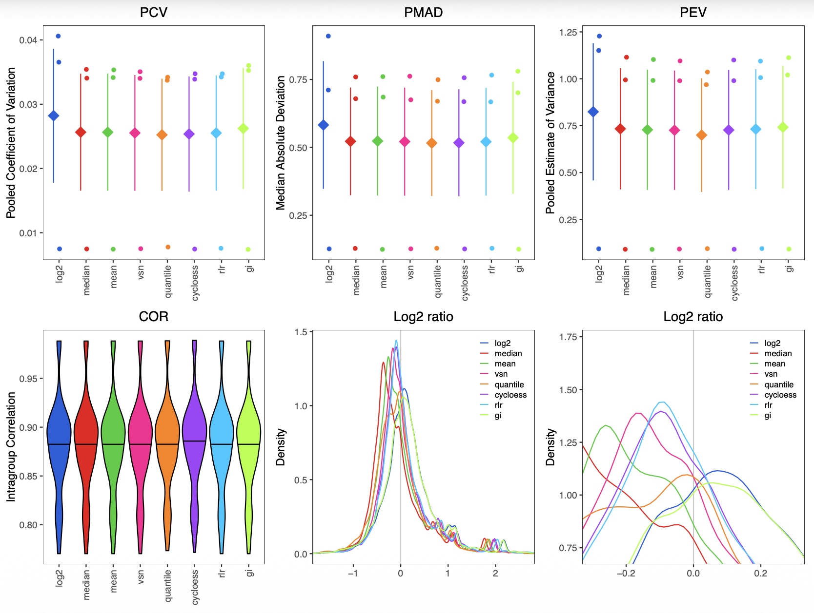
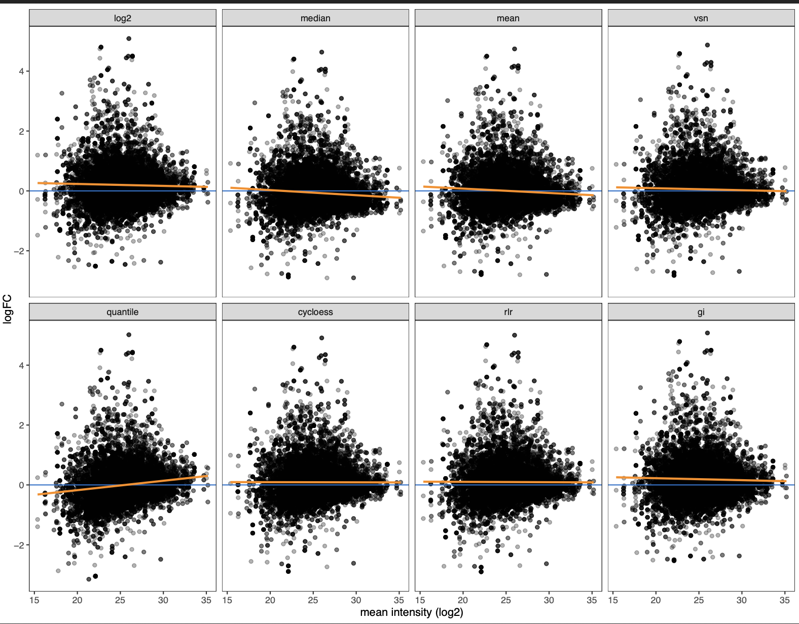

```{r knitsetup, include=FALSE}
knitr::opts_chunk$set(echo = TRUE, message=TRUE, warning = TRUE, fig.width=7, fig.height = 5)
```

# Overview

This vignette demonstrates the `proteoDA version 2.0` workflow using `DIANN` protein quantification as input. It runs the analysis twice:

1. Without imputation (leaving NA where values are missing).
2. With Perseus-style imputation (downshifted Gaussian).

## Outputs include:

A) Per-contrast limma results with z-score based effect size standardization.
B) Combined results tables and an Excel workbook with per-contrast sheets.
C) Interactive volcano/report HTMLs per contrast.
D) Perseus imputation diagnostics (before/after distributions).
E) Saved DAList objects for downstream QC and reporting.

## Requirements

1. `proteoDA >= 2.0`
2. A project `proteoDA_params.R` defining paths/labels/thresholds, e.g.:
  
  A. Define input and output file paths using: `input_quan`, `metadata`, `contrasts`, `QC_dir`, and `DA_dir` 
  B. Define annotation and sample start/end columns in `input_quan` using `anno_start`, `anno_end` and `sample_start` 
  C. Define limma design formula with `design`
  D. Define sample group information with `group` 
  E. Define protein filtering criteria with `filt_min_reps`, `filt_min_groups`, and `require_both_groups`
  F. Define statistical significance thresholds with `p.val`, `logFC`, `bin_size`, `stat_cols`
  G. Define visualization and reporting columns with `DA_table_cols`, `DA_title_col`, `ctrl_proteins`, `project_name`, `author`

For this vignette, we use a benchmark parameter script and data shipped with the package under:

- inst/extdata/lou2023_benchmark/

This directory contains:

- Lou_HF_DIANN_uni_prot_quan.csv (DIANN protein quant table)
- Lou_HF_sample_metadata.csv (sample metadata)
- Lou_contrasts.csv (benchmark contrasts for 0, 2-fold, 3-fold mixes)
- proteoDA_params.R (project parameters used here and on HPC)
- raw.rds (pre-built DAList object for normalization vignette)

The same pattern can be adapted to your own projects by placing a
proteoDA_params.R file and data in your project directory.

More details:

- **Data preprocessing** (import, alignment, filtering): see vignette("proteoDA_v2.0_preprocessing")
- **Normalization & imputation:** see vignette("proteoDA_v2.0_Norm_Impute")
- **Designs & contrasts** (basic → advanced): see vignette("proteoDA_v2.0_design")

# Installation

To install proteoDA version 2.0 from GitHub (with dependencies and vignettes built):

```{r install, eval=FALSE}
devtools::install_github("ByrumLab/proteoDA",
                         dependencies = TRUE,
                         build_vignettes = TRUE,
                         force = TRUE)
 # or
remotes::install_github("ByrumLab/proteoDA@v2.0.0",
                        dependencies = TRUE,
                        build_vignettes = TRUE,
                        force = TRUE)
```

# Load Packages and Parameters

```{r load_package, eval=TRUE}
library(proteoDA)
```

```{r}
## Locate the Lou 2023 benchmark directory

# 1) Try the installed-package location (works after install/build_vignettes)
bench_dir <- system.file("extdata/lou2023_benchmark", package = "proteoDA")

if (bench_dir == "") {
  bench_dir <- normalizePath(
    file.path("..", "inst", "extdata", "lou2023_benchmark"),
    winslash = "/",
    mustWork = TRUE
  )
  message("Using local development benchmark directory: ", bench_dir)
}

# Sanity check
stopifnot(dir.exists(bench_dir))

# Load benchmark project parameters (defines thresholds, labels, etc.)
params_file <- file.path(bench_dir, "proteoDA_params.R")
stopifnot(file.exists(params_file))
source(params_file)

# Override key input file paths to use the package system files
input_quan <- file.path(bench_dir, "Lou_HF_DIANN_uni_prot_quan.csv")
metadata   <- file.path(bench_dir, "Lou_HF_sample_metadata.csv")
contrasts  <- file.path(bench_dir, "Lou_contrasts.csv")
```

# Data setup to create a proteoDA DAList object for analysis

`proteoDA` ships with the Lou et al. 2023 DIA benchmark dataset (mouse:yeast complex mixes with 0-, 2-, and 3-fold changes), which we use here as an example.

```{r package_data}
# Read DIANN quant table (CSV)

stopifnot(file.exists(input_quan))
input_data <- read.csv(input_quan, stringsAsFactors = FALSE, check.names = FALSE)

# Defensive checks

if (!("Protein.Group" %in% colnames(input_data))) {
stop("Input data must contain a 'Protein.Group' column.")
}
```

## Make `uniprot_id` column and Clean Missing/Blank Entries

```{r 3_create_uniprot_id}
# Extract first UniProt ID from semicolon-delimited Protein.Group
uniprot_split <- strsplit(input_data$Protein.Group, ";", fixed = TRUE)
uniprot_id <- vapply(uniprot_split, function(x) if (length(x)) x[[1]] else NA_character_, "")
input_data <- cbind(uniprot_id = uniprot_id, input_data)

# Replace NAs and blanks: numeric -> 0; character -> "0"
for (nm in names(input_data)) {
  col <- input_data[[nm]]
if (is.numeric(col)) {
  col[is.na(col)] <- 0
  input_data[[nm]] <- col
} else {
  col[is.na(col) | col == ""] <- "0"
  input_data[[nm]] <- col
}
}

```

## Load Sample Metadata and Protein Annotation 

```{r 3_metadata_anno_load}
# Load sample metadata
#stopifnot(file.exists(metadata))
sample_metadata <- read.csv(metadata, stringsAsFactors = FALSE, check.names = FALSE)

# Protein annotation slice from input file using anno_start:anno_end from params
if (!exists("anno_start") || !exists("anno_end")) {
  stop("Parameters 'anno_start' and 'anno_end' must be defined in proteoDA_params.R")
}

# Protein annotation slice from input file using anno_start from params
if (!exists("anno_start") || !exists("anno_end")) {
stop("Parameters 'anno_start' and 'anno_end' must be defined in proteoDA_params.R")
}
annotation_data <- input_data[, anno_start:anno_end, drop = FALSE]

```

## Check sample `metadata` and the `input_quan` samples match

Verify the sample order in both the sample metadata and the protein intensity columns are named the same and in the same order. If not the `align_data_metadata()` will correct the data frames so the sample group information is correct. 

```{r 3_check_samples}

# Rename data columns: metadata$file -> metadata$sample where present

req_cols <- c("file", "sample")
missing_req <- req_cols[!(req_cols %in% colnames(sample_metadata))]
if (length(missing_req)) {
stop(paste("Metadata must contain columns:", paste(req_cols, collapse = ", ")))
}
rename_map <- setNames(sample_metadata$sample, sample_metadata$file)
present_files <- intersect(names(rename_map), colnames(input_data))

# Apply renaming in-place

if (length(present_files)) {
idx <- match(present_files, colnames(input_data))
colnames(input_data)[idx] <- rename_map[present_files]
}

# Build intensity matrix keeping only samples present in metadata

dat_ids <- colnames(input_data)
keep_samples <- dat_ids[dat_ids %in% sample_metadata$sample]
intensity_data <- input_data[, keep_samples, drop = FALSE]

# Trim metadata to these samples; rownames as sample IDs

sample_metadata <- sample_metadata[sample_metadata$sample %in% keep_samples, , drop = FALSE]
rownames(sample_metadata) <- sample_metadata$sample

# Auto-align (reorders and checks)

aligned <- align_data_and_metadata(
data                = intensity_data,
metadata            = sample_metadata,
sample_col          = "sample",
group_col           = "group",        # optional but recommended
prefer_group_blocks = FALSE,          # set TRUE to keep group blocks compact
strict              = FALSE
)

# (Optional) show alignment changes

aligned$changes

# Replace with aligned data

intensity_data  <- aligned$data
sample_metadata <- aligned$metadata

```

***

# Create `DAList` for analysis in proteoDA

`proteoDA` requires three data frames to import into a `DAList` S3 object: 

1. protein annotation
2. sample metadata
3. protein intensities

```{r 4_raw_DAList}
raw <- DAList(
    data      = intensity_data,
    annotation= annotation_data,
    metadata  = sample_metadata,
    design    = NULL,
    eBayes_fit= NULL,
    results   = NULL,
    tags      = NULL
)

# Convert embedded zeros to NAs for downstream missingness-aware steps
filtered_samples <- zero_to_missing(raw)
# Quick sanity: group counts
# How many samples per group?
table(filtered_samples$metadata$group)

```

> In the Lou et al. benchmark, the groups encode mouse:yeast mixes with 0-fold (no change), 2-fold, and 3-fold differences.  
> The `table()` output should confirm the expected number of replicates per group (e.g., 5 replicates per condition).  
> Before proceeding, verify that the group labels match what you intend to test in your contrasts file.

***

# Protein Filtering 

A new function `filter_proteins_per_contrast()` has been added to separately filter each sample group comparison in the `contrasts.csv` based on the user selected thresholds. The `filter_proteins_by_group()` will filter all sample groups together for a more global filtering approach (see `vignette/proteoDA_v1.0_workflow.Rmd`). This may all proteins that are missing in two sample groups to still be present in the data for that particular limma analysis. 

 `filter_proteins_per_contrast()`

- Requires a `contrasts.CSV` defining sample group comparisons.

```{r 5_protein_filtering}

stopifnot(file.exists(contrasts))

filtered_DALists <- filter_proteins_per_contrast(
  DAList              = filtered_samples,
  contrasts_file      = contrasts,
  min_reps            = filt_min_reps,
  require_both_groups = require_both_groups,
  grouping_column     = group
)

# Summarize counts
summary_df <- data.frame(
  contrast = names(filtered_DALists$filtered_proteins_per_contrast),
  filtered_proteins = vapply(filtered_DALists$filtered_proteins_per_contrast, length, 1L)
)
summary_df
```

> Each row corresponds to a contrast defined in `Lou_contrasts.csv`.  
> `filtered_proteins` is the number of proteins that pass the per-contrast missingness criteria (`filt_min_reps`, `require_both_groups`).  
> In the Lou benchmark, the no-change contrast should retain a similar number of proteins as the 2- and 3-fold contrasts; large differences here may indicate overly strict filtering.

***

# Normalization Methods

`proteoDA` includes 8 common normalization methods including: log2 transformation (`log2`), log2 median (`median`), log2 mean (`mean`), variance stabilizing normalization (`vsn`), log2 quantile (`quantile`), cyclic loess (`cycloess`), robust linear regression (`rlr`), and log2 global intensity (`gi`). For more details see the `proteoDA_v2.0_Norm_Impute` vignette. 

If the data have been normalized using an outside method, then proteoDA normalization can be skipped. However, the normalization method must be defined in the `DAList$tags$norm_method` slot for reporting. 

## Evaluate normalization methods

We first generate a PDF report that evaluates all supported methods on the Lou benchmark data.

```{r 6_normalization, eval=FALSE}
##############
## NORMALIZATION
## methods = "log2", "median", "mean", "vsn", "quantile", "cycloess", "rlr", "gi"
###############

# write normalization report to choose the best method
write_norm_report(
  filtered_DALists,
  grouping_column      = group,
  output_dir           = "QC_report",
  filename             = "normalization_new.pdf",
  overwrite            = TRUE,
  suppress_zoom_legend = FALSE,
  use_ggrastr          = FALSE
)
```

For the vignette, we include two summary figures saved in
vignettes/images/:

{width=80%}

The top row compares pooled coefficient of variation (PCV), pooled median absolute deviation (PMAD), and pooled estimate of variance (PEV) across methods. Lower values indicate better within-group precision.

The bottom row shows:

- Intragroup correlation (COR) across replicates
- Distribution of log2 ratios for all proteins
- Density of log2 ratios near 0

For the Lou benchmark, several methods perform similarly, but cyclic
loess (cycloess) tends to:

- Maintain low PCV/PMAD/PEV
- Preserve tight intragroup correlation
- Keep the log2 ratio distribution centered near 0 for the no-change mix

We also inspect MA plots (mean–log2FC) to check for intensity-dependent
bias:

{width=80%}

Each facet shows log2 fold-change vs mean log2 intensity for one normalization method, with smoothing lines overlaid.

- Methods with strong slopes or curvature (especially at low intensity) indicate residual intensity-dependent bias.

- Cyclic loess produces one of the flattest trends across the full intensity range, suggesting good correction of systematic effects.

Based on these diagnostics, we proceed with cyclic loess for the Lou et al benchmark.

Note: Cyclic loess (limma::normalizeCyclicLoess); if groups supplied, normalize within each group independently; otherwise normalize globally

## Perform normalization

```{r cyclicbygroup}
norm <- normalize_data(
  filtered_DALists,
  norm_method   = "cycloess",
  input_is_log2 = FALSE,     # set TRUE if your per-contrast data are already log2
  groups     = filtered_DALists$metadata$group # for cyclic loess only will perform within groups
)

# ONLY IF already normalized - copies the DAList first and then adds the norm method tag
#norm <- filtered_DALists
#norm$tags$norm_method <- "trimmed_median"
```

> The normalization report (`QC_report/normalization_new.pdf`) compares several methods.  
> For the Lou benchmark, cyclic loess (`"cycloess"`) typically yields the most stable variance across the intensity range, so we use it in this workflow.  
> On your own data, inspect the PDF and choose the method that best flattens the moving SD curves and aligns sample distributions (see `proteoDA v2.0 Normalization` vignette)

***

# Perseus-Style Imputation using the normal distribution

`proteoDA` v2.0 now includes the option to impute missing values using the downshifted Gaussian distribution similar to that of the Perseus software by Cox lab. 

**Reference:** Tyanova, Stefka, and Juergen Cox. 2018. “Perseus: A Bioinformatics Platform for Integrative Analysis of Proteomics Data in Cancer Research.” In, 133–48. Springer New York. https://doi.org/10.1007/978-1-4939-7493-1_7. 

```{r 7_Perseus_imputation}
# Perseus’s normal distribution imputation (downshifted Gaussian on normalized log2)
set.seed(1)
imputed <- perseus_impute(
    norm,
    shift = 1.8,
    width = 0.3,
    robust = TRUE,       # logical, use median/MAD (TRUE) or mean/SD (FALSE) per sample
    save_before_after = TRUE,  # used to generate histogram figure
    seed = 1
)

# Diagnostic plots (histograms/densities before vs after), saved if out_dir provided
plots <- write_perseus_imputation_plots(
    DAList      = imputed,
    out_dir     = "PerseusPlots",
    bins        = 30,
    facet_ncol  = 4,
    overlay     = TRUE,
    width       = 10,
    height      = 7,
    dpi         = 300,
    device      = "png"
)

# To preview one plot in an interactive R session:
# print(plots[["YOUR_CONTRAST_NAME"]])
# List available contrasts for which imputation plots were generated
names(plots)
```

## Perseus Imputation Diagnostics

The figure below shows the distribution of log2 intensities before and after Perseus-style imputation for the `M1Y1_vs_Ref` contrast.

Each panel corresponds to one sample, with:

- Observed log2 intensities shown in blue
- Imputed values (downshifted Gaussian) shown in red

```{r}
# Example: display one contrast in the HTML vignette while knitting
# (replace "M2Y1_vs_Ref" with a real contrast name in the Lou contrasts)
print(plots[["M2Y1_vs_Ref"]])

```

> Each element of `plots` is a before/after distribution for one contrast.  
> The left side shows the original log2 intensity distribution; 
> the right side shows the distribution after filling in missing values with a downshifted Gaussian.  
> In well-behaved data, the imputed values form a left-shifted shoulder, representing low-abundance proteins below the detection limit.

Note: If you don’t want to rely on a specific contrast name, you can just `print(plots[[1]])`, which is the first contrast.

## Interpretation

Perseus imputation is designed to model missing not at random (MNAR) values, which is typically proteins that fall below the instrument’s detection limit. Instead of replacing missing values with a fixed constant or a random guess, the algorithm:

- Estimates the center and spread of the observed log2 intensities in each sample.
- Draws imputed values from a narrow, left-shifted normal distribution representing low-abundance peptides.
- Inserts these values only at positions originally containing `NA`.

In the diagnostic plot:

- The blue distributions show the observed log2 protein intensities (typically ranging from ~15–30).

- The red distributions appear as a small bump on the lower-intensity side (~10–15), reflecting the downshifted Gaussian used for imputation.

- The imputed values occupy a biologically plausible range: low-intensity but not zero, helping stabilize statistical modeling downstream (e.g., limma).

- Samples with more missingness show slightly larger red regions, as expected.

Why this diagnostic matters?

This visualization verifies that:

- imputation was performed on log2-transformed, normalized data
- imputed distributions do not overlap with the main signal region (preventing bias)
- missing values were replaced with intensities consistent with low-abundance proteins rather than arbitrary constants.

If the red distributions were too high, too wide, or overlapping heavily with the blue distributions, that would indicate a problem with the imputation parameters or with the preprocessing workflow.

Here, the clear separation between observed and imputed intensities confirms that Perseus-style MNAR imputation behaved as expected.

> “For more details on the Perseus-style imputation method and parameter choices, see the *Perseus imputation* section in `vignette('proteoDA_v2.0_Norm')`.”

***

# Run Limma (No Imputation vs Perseus Imputation) 

```{r 9_run_limma}

# you can define thresholds here if you want to override those from proteoDA_params.R
common_args <- list(
design_formula  = design,
pval_thresh     = p.val,
lfc_thresh      = logFC,
adj_method      = "BH",
binsize         = bin_size,
plot_movingSD   = FALSE,
contrasts_file  = contrasts
)

# 1) Without imputation (leave NAs)
results <- do.call(run_filtered_limma_analysis, c(list(DAList = norm), common_args))

# 2) With Perseus imputation
results2 <- do.call(run_filtered_limma_analysis, c(list(DAList = imputed), common_args))

```

# Summarize limma results per contrast

```{r 9_run_limma_summary}
# A simple helper to summarize DA counts per contrast
summarize_contrast <- function(dalist) {
  res <- dalist$results
  data.frame(
    contrast = names(res),
    n_up     = vapply(res, function(x) sum(x$sig.FDR == 1L,  na.rm = TRUE), 1L),
    n_down   = vapply(res, function(x) sum(x$sig.FDR == -1L, na.rm = TRUE), 1L),
    n_ns     = vapply(res, function(x) sum(x$sig.FDR == 0L,  na.rm = TRUE), 1L)
  )
}

summary_no_imp  <- summarize_contrast(results)
summary_imp     <- summarize_contrast(results2)

summary_no_imp
summary_imp
```

> `n_up` / `n_down` count proteins with significant positive / negative log2 fold-change at the chosen FDR threshold, and `n_ns` the non-significant proteins.  
> In the Lou benchmark:
>
> - The **no-change** mix (e.g., `M1Y1_vs_Ref`) should have very few significant hits (mostly `n_ns`).  
> - The **2-fold** mix should show a moderate number of up-regulated proteins with log2FC ≈ 1.  
> - The **3-fold** mix should show more and larger effects (log2FC ≈ 1.6).  
>
> Comparing `summary_no_imp` and `summary_imp` lets you see how Perseus imputation affects sensitivity and the number of called hits.

***

# Build Statlists, Write Tables, and generate plots

## Write Tables

```{r 10_statlists, eval = FALSE}
# Build "full universe" statlists across all contrasts for each run

statlist  <- build_statlist(DAList = results,  stat_cols = stat_cols)
statlist2 <- build_statlist(DAList = results2, stat_cols = stat_cols)

# Write per-contrast CSVs + combined CSV + Excel with sheets

dir.create(DA_dir, showWarnings = FALSE, recursive = TRUE)

write_limma_tables(
    results,                     # A DAList object with statistical results.
    output_dir         = DA_dir, # Directory to output tables. Defaults to working directory.
    overwrite          = TRUE,   # Logical. Overwrite existing files?
    contrasts_subdir   = NULL,   # Subdirectory for per-contrast CSV files
    summary_csv        = NULL,   # Filename for summary CSV
    combined_file_csv  = NULL,   # Filename for combined results CSV.
    spreadsheet_xlsx   = NULL,   # Filename for Excel spreadsheet
    add_filter         = TRUE,   # Logical. Add filters to Excel columns?
    color_palette      = NULL,   # Optional color palette for Excel output.
    add_contrast_sheets= TRUE,   # Logical. Whether to add each per-contrast CSV as a worksheet in the Excel file.
    statlist           = statlist # Optional list of per-contrast result tables to use instead of DAList$results
)

## --- Imputed results -------
dir.create("impute_out", showWarnings = FALSE, recursive = TRUE)

write_limma_tables(
    results2,
    output_dir         = "impute_out",
    overwrite          = TRUE,
    contrasts_subdir   = NULL,
    summary_csv        = NULL,
    combined_file_csv  = NULL,
    spreadsheet_xlsx   = NULL,
    add_filter         = TRUE,
    color_palette      = NULL,
    add_contrast_sheets= TRUE,
    statlist           = statlist2
)


```

## Write Plots

- These functions produce a standalone interactive HTML reports per contrast and static images

```{r 10_write_plots, eval=FALSE}
# no imputation
write_limma_plots(
    DAList           = results,
    grouping_column  = group,
    table_columns    = DA_table_cols, # values must be present in protein annotation
    title_column     = DA_title_col,  # value displayed in dotplots in interactive htmls
    height           = 1000,
    width            = 1000,
    output_dir       = DA_dir,
    overwrite        = TRUE,
    control_proteins = ctrl_proteins, # proteins of known biological interest to highlight in volcanos
    highlight_by     = "uniprot_id",  
    image_formats    = c("pdf","png")
)

# Perseus imputed data 
write_limma_plots(
    DAList           = results2,
    grouping_column  = group,
    table_columns    = DA_table_cols,
    title_column     = DA_title_col,
    height           = 1000,
    width            = 1000,
    output_dir       = "impute_out",
    overwrite        = TRUE,
    control_proteins = ctrl_proteins,
    highlight_by     = "uniprot_id",
    image_formats    = c("pdf","png")
)

```

## ✅ Volcano Plot (Base R + ggplot2 only)

Red = up-regulated, Blue = down-regulated, Grey = not significant

```{r volcano_colored_no_tidyverse, message=FALSE, warning=FALSE}
library(ggplot2)

logFC_thresh = 1
# Pick one contrast for demonstration
example_contrast <- names(results$results)[1]
tab <- results$results[[example_contrast]]

# Create a "status" classification using base R
status <- rep("NS", nrow(tab))

# Up-regulated: significant & log2FC >= threshold
status[ tab$P.Value < p.val & tab$logFC >=  logFC_thresh ] <- "Up"

# Down-regulated: significant & log2FC <= –threshold
status[ tab$P.Value < p.val & tab$logFC <= -logFC_thresh ] <- "Down"

# Add status column to table
tab$status <- factor(status, levels = c("NS", "Up", "Down"))

# Define colors
volcano_colors <- c(
  "NS"   = "grey60",
  "Up"   = "red",
  "Down" = "blue"
)

ggplot(tab, aes(x = logFC, y = -log10(P.Value), color = status)) +
  geom_point(alpha = 0.6, size = 1.5) +
  scale_color_manual(values = volcano_colors) +
  geom_vline(xintercept = c(-logFC_thresh, logFC_thresh), linetype = "dashed") +
  geom_hline(yintercept = -log10(p.val), linetype = "dashed") +
  labs(
    title = paste("Volcano plot:", example_contrast),
    x     = "log2 fold-change",
    y     = "-log10(p-value)",
    color = "Status"
  ) +
  theme_bw()
```

### 🎨 Interpretation of the colors

| Color | Meaning |
|-------|---------|
| **Red** | Up-regulated proteins: log2FC ≥ threshold **and** P.Value < threshold |
| **Blue** | Down-regulated proteins: log2FC ≤ –threshold **and** P.Value < threshold |
| **Grey** | Non-significant proteins |

This matches classic volcano-plot conventions and is consistent with DIANN, Perseus, and most differential abundance software.


> This volcano plot shows the log2 fold-change vs. –log10 p-value for a single contrast.  
> The dashed vertical lines indicate the log2FC threshold (`±logFC`), and the dashed horizontal line indicates the p-value threshold (`p.val`).  
> Significant proteins typically occupy the upper left and upper right quadrants.  
> For the Lou benchmark, the 2-fold and 3-fold contrasts should show clear shifts of spiked-in proteins into the upper right quadrant.

*** 

You’ve completed the **proteoDA v2.0** workflow!

- **Results without imputation** are saved under `DA_dir/`
- **Results with Perseus imputation** are saved under `impute_out/`
- **Interactive per-contrast HTML reports** are created in each folder  
  (open them directly in your web browser)
- **Combined results tables** and **Excel workbooks** are written automatically
- The final `.rds` files are saved in your working directory:
  - `results_NA.rds` → with `NA`s retained  
  - `results_imputed.rds` → after Perseus imputation  
  - `results.rds` → zero-filled version for QC/PCA utilities
- Session details are logged in `sessionInfo.txt`
- All project variables are updated in `_variables.yml` for PowerPoint generation

---

💡 **Next steps:**
- Explore significant hits using volcano or MD plots  
- Integrate results into pathway or enrichment analysis  
- Reuse the saved `DAList` objects in downstream QC and report generation

# Notes & Tips

1. Ensure your contrast file and metadata agree with your design. The diagnostic chunk reports full rank and aliasing issues early.

2. If your metadata and data sample IDs were out of order (e.g., lexicographic 1, 10, 11, 2…), `align_data_and_metadata()` fixes this using name matching, not position. It defaults to the order in the sample_metadata.csv. 

3. DIANN and Spectronaut export different column names for protein annotation, adjust `anno_start`, `anno_end` and `DA_table_cols` accordingly.

4. If you want to evaluate other factors in the data, such as age, sex, or celltype; add the `sample_metadata` column names for each factor to the proteoDA_params.R `pca_grouping_columns` and `den_grouping_columns`.

5. Label any control proteins of interest in the static Volcano plots by adding the `uniprot_id` to the **proteoDA_params.R** `ctrl_proteins` variable. 

# Design Sanity Check (Full Rank & Aliasing) 

```{r 8_design_check, eval=FALSE}
# Build a model frame from metadata according to your 'design' formula
if (!exists("design")) stop("Parameter 'design' must be defined (e.g., ~0 + group).")

mf <- model.frame(formula = design, data = norm$metadata, drop.unused.levels = TRUE)
mm <- model.matrix(attr(mf, "terms"), data = mf)

# 1) Full rank check
qr_rank <- qr(mm)$rank
is_full_rank <- (qr_rank == ncol(mm))

cat("Design matrix columns:", ncol(mm), "\n")
cat("Design matrix rank   :", qr_rank, "\n")
cat("Full rank?           :", is_full_rank, "\n\n")

# 2) Aliased coefficients (if any)

aliased <- alias(lm.fit(x = mm, y = rnorm(nrow(mm))))$Complete

if (!is.null(aliased)) {
  cat("Aliased (non-estimable) coefficient relationships detected:\n")
  print(aliased)
} else {
  cat("No aliased coefficients detected.\n")
}


```

## Troubleshooting: Design Matrix and Contrast Mismatch

If you see an error in `run_filtered_limma_analysis()` such as:

- Error in contrasts.fit(...):
- row names of contrast matrix do not match column names of design matrix

this means the *contrast file labels* (e.g., group names or coefficients) don’t match the *design matrix column names*.  Use the following diagnostic commands to inspect and correct them.

```{r troubleshoot_design, eval=FALSE}
# ---- Inspect design and contrasts ----
# Show design matrix column names

cat("Design matrix columns:\n")
print(colnames(mm))

# Read and inspect your contrasts CSV
cat("\nDefined contrasts from file:\n")
contrasts_df <- read.csv(contrasts, stringsAsFactors = FALSE)
print(contrasts_df)

# Example: If your design formula was ~0 + group
# then design matrix columns should look like "A", "B", etc.
# Ensure that the contrasts file refers to those names exactly.

# Check for mismatched column names
bad_cols <- setdiff(unique(unlist(contrasts_df)), colnames(mm))
if (length(bad_cols)) {
  cat("\n⚠️ The following contrast terms do not match design columns:\n")
  print(bad_cols)
  cat("\nPlease correct your contrasts.csv to use the exact column names above.\n")
} else {
  cat("\n✅ All contrast terms match design matrix columns.\n")
}

# Optional: visualize design matrix
head(mm)

```

### 💡 If you still encounter errors

You can build your design and contrast matrices manually using the legacy version 1.0 syntax from the original `proteoDA`:

``` {r proteoDA1.0_design, eval = FALSE}
# Recreate design and contrast matrices explicitly
# replace DAList with your object
DAList <- add_design(DAList = norm, design_formula = ~0 + group)
DAList <- add_contrasts(DAList = DAList, contrasts_file = contrasts)
DAList <- fit_limma_model(DAList)
```

This will let you see the internal column naming directly before running
`run_filtered_limma_analysis()` in version 2.0.

If the design works with the old commands but fails in v2.0,
check for renamed groups, factor levels, or spaces in your contrast file headers.

