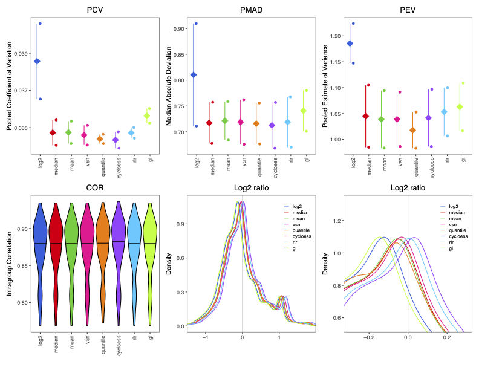

```{r setup, include=FALSE}
knitr::opts_chunk$set(echo = TRUE)
```

## Installation 

If you have this vignette, you should already have `proteoDA` installed. If not, installation is simple. `proteoDA` is not yet on CRAN, but it can be installed from GitHub using the `devtools` package:

```{r, eval = F} 

install.packages("devtools")
devtools::install_github("ByrumLab/proteoDA", 
                         dependencies = TRUE, 
                         build_vignettes = TRUE)
```

Once `proteoDA` is installed, load it:

```{r}
library(proteoDA)
```

## Data Import and Requirements

`proteoDA` stores data and results in a `DAList`, a list object with a special structure and class (its an S3 class, for the R nerds). DA stands for "differential abundance", the type of analysis a `DAList` is meant for.  A `DAList` contains 7 items (which we also call slots): data, annotation, metadata, design, eBayes_fit, results, and tags. Generally, you only need to worry about the first three slots, and `proteoDA` will take care of the rest. They are:

1. **data**- A data frame or matrix containing protein intensity values for each sample.  The rows contain data from a specific protein, and columns represent individual samples. The names of the columns must match the row names of the metadata (see below).

2. **annotation**- A data frame containing annotation information for the proetins. These could be protein accession numbers, description, gene symbols, etc. There is only one required item: the annotation data must contain a column titled "uniprot_id" (no capital letters!), and the values in that column must be unique to each row (this is how `proteoDA` keeps track of the unique proteins in your experiment).

3. **metadata**- A data frame containing sample information such as sample name, group, gender, batch, etc. The row names of the metadata must match the column names of the data. 

### Data import example

Using some example data, we'll walk through how to prepare existing data for use with `proteoDA`. Our example data consists of two files: 

1. `DIA_data.csv`, a comma-separated value file containing a mix of protein intensity and annotation data, similar to data you might receive from, for example, a Scaffold DIA file.

2. `metafile.csv`, a comma-separated value file containing sample information and metadata.

These examples come bundled with the `proteoDA` package, and we can import the files and take a look at them using standard R functions:

```{r}
input_data <- read.csv(system.file("extdata/DIA_data.csv", package = "proteoDA"))
sample_metadata <- read.csv(system.file("extdata/metafile.csv", package = "proteoDA"))
```

```{r, eval = F}
head(input_data)
```

The `input_data` is a data frame with 9089 rows (each corresponding to one protein) and 21 columns. The first 4 columns give protein annotation information: a UniProt ID, some protein info from the database search, etc. The remaining 17 columns give the per-sample protein intensities.  

```{r, eval = F}
head(sample_metadata)
```

The `sample_metadata` is a dataframe with 17 rows giving information on each sample: the column name in the `input_data` which corresponds to that sample, the sample ID, the sample batch (all the same, in this case), and a "group" column describing the sample type: 3 pooled samples used for characterizing all proteins during the database search, 7 samples from normal, non-cancercous tissue, and 7 samples from cancer tissue. The goal of our experiment is to find proteins that are differentially abundance in cancer and non-cancer cells. 

For making our `DAList` object, we need to separate out the protein annotation data and protein intensity data in the `input_data` data frame. There are a number of ways to do this in `R`, but an easy way is to subset each data frame based on the indicies of the desired columns:

```{r}
intensity_data <- input_data[,5:21] # select columns 5 to 21
annotation_data <- input_data[,1:4] # select columns 1 to 4
```

When creating data frames of intensity data and annotation information for a `DAList` object, it is important to ensure that the rows are in the right order: the `DAList()` function used to create a `DAList` keeps the rows in the order provided. If you provide the intensity and annotation data in different orders, they will not match up properly. The method above does not change the row orders. 

Finally, before creating our `DAList` object, we can return to the two requirements we mention above: 

1. The annotation data should contain a column name "uniprot_id" which contains a unique entry for each row/protein. Our example data already fulfills this criteria.

2. The row names of the metadata should equal the column names of the protein intensity data. We can check this:


```{r}
rownames(sample_metadata)
```

At the moment, the row names are just numbered: `DAList()` won't be able to match up the rows in `sample_metadata` to the columns in `intensity_data`. Fortunately, the column name information is already available in the metadata, we can just assign it to the rownames of `sample_metadata`:

```{r}
rownames(sample_metadata) <- sample_metadata$data_column_name
```

Now, we're ready to make our `DAList` of the raw data. 

```{r}
raw <- DAList(data = intensity_data,
              annotation = annotation_data,
              metadata = sample_metadata)
```

You can examine the individual elements of the `DAList` using the `$` operator in R:

```{r, eval = F}
# Look at the intensity data
raw$data

# Look at the metadata
raw$metadata
```
 
## Sample and protein filtering 

Before analysis, we need to do some filtering of the raw data. First, we can filter out some unneeded samples. Our raw data contains three pooled samples, made from pooling all the samples together. STEPHANIE ADD SOME INFO ON THE RATIONALE BEHIND THIS. We do not want to analyze these pooled samples for differential abundance. 

`proteoDA` has a function, `filter_samples()` that can be used to remove samples from a `DAList` object. All functions in `proteoDA` have reference pages, lets take a look at the reference for `filter_samples()`:

```{r, eval = F}
?filter_samples
```

This function takes two arguments: an input `DAList` and a condition: a logical expression which describes which samples should be kept. In our case, we want to remove the pool samples, and keep all non-pool samples. So, let's keep all samples where the "group" column in the sample metadata does not equal "Pool":

```{r, message = F}
filtered_samples <- filter_samples(raw, group != "Pool")
```

Next, we may want to filter out proteins with a large amount of missing data. `proteoDA` provides two functions to do this: `filter_proteins_by_group()` and `filter_proteins_by_proportion()`. With `filter_proteins_by_group()`, the user specifies the minimum number of samples and groups for which a protein must have non-missing data: e.g., a protein must be present in at least 4 samples in at least 3 groups to be kept. `filter_proteins_by_proportion()` is similar, but the user specifies a minimum proportion, instead of a minimum number: this is useful for cases when sample sizes are unequal across groups. 

Here, it is important to note that these filtering functions only filter on missing values (`r NA`), not zero values. The distinction between missing values and zeroes is important: a missing value says we do not know whether a protein was present or not, while a zero says that we know a protein definitely was not present. `proteoDA` has two functions to help you manage missing values in the way that is appropriate for your data: `zero_to_missing()` will convert 0 values to missing data, while `missing_to_zero()` will convert missing values (usually `r NA`, but you can specify other values depending on how your data are encoded) to zero. 

In our example data, many proteins have zero intensity. Generally in mass spectrometry, this is because the protein was below the detection limit of the instrument: the protein may have been present at low quantities, and we can't say for sure that the protein was not present. So, we'll convert these to missing values, and then filter out proteins with too much missing data. A good rule of thumb is to require non-missing data in ~2/3 of the replicates. For our example data, with 7 replicates per group, we'll require non-missing data for at least 4 samples:

```{r, message=FALSE}
# Convert missing values
filtered_samples <- zero_to_missing(filtered_samples)
filtered_proteins <- filter_proteins_by_group(filtered_samples,
                                              min_reps = 4,
                                              min_groups = 2,
                                              grouping_column = "group")
```

The printed message from `proteoDA` tells us that 203 proteins were removed. 

If there are any specific proteins you'd like to remove (e.g., known contaminants, proteins you are uninterested in, etc), you can use the `filter_proteins_by_annotation()` function to remove proteins based on their annotation data. 

Here it is useful to note that most `proteoDA` functions take a `DAList` as input and return a `DAList` as output. This makes it easy to pipe multiple commands together into data processing pipelines. Below, we can take our raw data, remove the pool samples, convert missing values, and filter out missing proteins all in one pipeline (filtering by proportion this time, just as an example):

```{r, message = F}
filtered <- raw |>
  filter_samples(group != "Pool") |>
  zero_to_missing() |>
  filter_proteins_by_proportion(min_prop = 0.66,
                                grouping_column = "group")
```

By default, the output of the function on the left-hand side of the pipe operator, `|>`, is passed as input to the first argument of the function on the right hand side of the pipe (see the pipe operator documentation at ```?|>``` for more information). For functions in `proteoDA`, the first argument is always the input `DAList`, which makes piping commands together easy. 

## Normalization

After filtering, the raw intensity data should be normalized, so that technical variability between samples doesn't affect the inference of differential abundance. Normalization is a complex topic, and there are a wide variety of possible normalization methods. `proteoDA` includes 8 popular normalization methods and a tool to help you choose the best normalization method: `write_norm_report()`.

The `write_norm_report()` functions applies all 8 normalization methods to a dataset and outputs a PDF report containing plots of different normalization metrics. Specifically, it evaluates the pooled coefficient of variance (PCV) within sample groups, the pooled median absolute deviation (PMAD) within sample groups, the pooled estimate of variance (PEV) within sample groups, the pairwise correlation of sample intensities (COR) within sample groups, and the pairwise ratios of average log2-transformed intensities between groups. 


```{r, eval = F,message = F}
# This will save in your current working directory by default, but
# you can use the output_dir argument to specify a different output. 
write_norm_report(filtered,
                  grouping_column = "group")
```

The first page of the PDF output should look like this:

```{r out.width = '70%', echo = FALSE, fig.align='center'}

```

In general, you want to pick a normalization method that has low levels of within-group variability (PCV, PMAD, and PEV) and high levels of within-group correlation (COR), with a log2 density ratio that is roughly symmetric around 0 (though, when there are only two groups being compared, as in this case, the log2 ratio plots are OK if they aren't symmetric). The second page of the normalization report (not shown) gives MA plots of average expression against the average log2 ratio between groups: a good normalization method should have a relatively flat trend (orange line). 

It is important to note that, although we need to include a grouping variable to calculate within-group statistics for *evaluating* normalization methods, the actual *calculation* of these normalizations is done across all samples without regard to grouping (i.e., `proteoDA` performs global, not local, normalization). Thus, though providing different grouping columns when creating the normalization report might affect your evaluation of normalization methods, the underlying normalized values will be the same. 


For these example data, cyclic loess normalization ("cycloess" in the report) looks like a good choice, though all the normalization methods besides simple log2 transformation perform similarly (which is generally a good sign). Now that we've chosen that method, we can normalize our data (this will overwrite the raw data with normalized data, so it's a good idea to save this as a new `DAList` object):

```{r}
normalized <- normalize_data(filtered, 
                             norm_method = "cycloess")
```

For more information on normalization, check out [this paper](https://pubs.acs.org/doi/10.1021/pr401264n) on normalization, or [proteiNorm](https://github.com/ByrumLab/proteiNorm), an interactive normalization evaluation tool on which `proteoDA` is based. 

## Quality control report

Once the data have been normalized, you can explore the quality and structure of the data using the `write_qc_report()` function. This function creates and saves a variety of diagnostic plots: violin plots of per-sample intensities; PCAs, dendrograms, and correlation heatmaps to show similarity between samples and how they cluster together, and heatmaps which show the amount of missing data across samples. 


```{r, eval = F, message = F}
write_qc_report(normalized,
                color_column = "group")
```

See the reference page of the `write_qc_report()` for more options on how to customize these reports.

In the case of this report, the PCA plot and dendrogram indicate that two samples, Sample_07 and Sample_08, are slight outliers that do not cluster with the rest of the samples. Depending on what information you have on samples, and your overall sample sizes, you may choose to remove such samples, by going back to the `filter_samples()` function (you would want to re-run the downstream protein filtering and normalization functions as well). For this tutorial, we will more forward without further filtering. 

## Specifying a statistical design

Now, we're ready to specify the statistical analysis to perform. `proteoDA` uses a model formula syntax that should be familiar to users of other R modelling functions and packages (e.g, `lm()` or the `lme4` package). Models take the form `~ terms` (unlike other models, no left-hand side is needed: the response variable to be modeled is the protein intensity). `proteoDA` can fit models with and without intercepts (e.g., `~ group` or `~ 0 + group`, respectively). Models may contain multiple terms (e.g., `~ group + sex`), and those terms could be interactive (e.g., `~ group * sex`). `proteoDA` also has limited support for mixed models with random effects: users can include a single random-effect term that influences the intercept (e.g., `~ group + (1 | batch)`).

The model fitting in `proteoDA` is performed using functions from the `limma` [R package](https://bioconductor.org/packages/release/bioc/html/limma.html). We highly recommend [this guide](https://doi.org/10.12688/f1000research.27893.1) from the `limma` team on specifying experimental designs and contrasts: though the syntax is slightly different, much of the material applies to `proteoDA` as well. 

For this tutorial, we will demonstrate fitting the same statistical model both with and without an intercept term. 

### Intercept model

In our example data, we're interested in differential abundance between normal tissue and cancer tissue, as specified in the "group" column of the metadata. We can add a statistical design to examine differential abundance across groups using an intercept model:

```{r}
intercept <- add_design(normalized,
                        design_formula = ~ group)
```

This intercept model will estimate two quantities for each protein: 

1. The intercept, which will be the average expression in one of the two groups, which we will call the reference group.
1. The difference in average expression between the reference group and the second group. This second quantity is the differential abundance that we're interested in. 

There is an important issue to consider: which group will be the reference group? `proteoDA` follows the `R` default, in which the category that is first in alphabetical order is the reference group. In this example data, that means the reference group is the cancer group, which we can see by examining the design matrix:

```{r}
head(intercept$design$design_matrix)
```

Thus, the differential abundance would be the change in normal tissue relative to cancer tissue. In this case, we probably want the opposite: we want to know how proteins in cancer tissue are changed relative to normal tissue. To address this, we can convert the "group" column of the metadata into a factor and set the levels ourselves, with "normal" as the first level and "cancer" as the second:


```{r}
normalized$metadata$group <- factor(normalized$metadata$group, 
                                    levels = c("normal", "cancer"))
```

We can remake our design matrix:

```{r}
intercept <- add_design(normalized,
                        design_formula = ~ group)
```


```{r}
head(intercept$design$design_matrix)
```

Now, the reference group is the normal group and the model will estimate the differential abundance in cancer tissue.

### No intercept model

Alternatively, we could specify our model slightly differently, using a no-intercept model:

```{r}
no_intercept <- add_design(normalized,
                           design_formula = ~0 + group)
```

With no intercept, the model will estimate the average expression level in each group:

```{r}
head(no_intercept$design$design_matrix)
```

However, we aren't interested in the average level of expression in each group: we want the difference in expression between normal and cancer tissue. By default, `proteoDA` will estimate each model term in the design matrix. However, as in `limma`, we can use contrasts to override this behavior and estimate different terms that are derived by performing mathematical operations on the terms in the design matrix. For our example differential abundance analysis, this is simple: we want to calculate the difference between the average expression in cancer and normal tissue, `cancer - normal`. We can use the `add_contrasts()` function to do this:

```{r}
no_intercept <- add_contrasts(no_intercept,
                              contrasts_vector = "cancer_vs_normal = cancer - normal")
```

Contrasts should follow this form: `contrast_name = contrast - operation`, where "contrast name" will be the new name for the term being estimated and the "contrast operation" section gives the mathematical operation used to create a new contrast (here, subtracting the normal term from the cancer term). In some cases, a user may have many contrasts they want to calculate, and typing them all by hand could be a pain. In that case, users can specify contrasts in a `.csv` file:

```{r, message = F}
no_intercept <- add_contrasts(no_intercept,
                              contrasts_file = system.file("extdata/contrasts.csv", package = "proteoDA"))
```

Contrasts can be quite elaborate, and can include more than two terms. Again, [this guide](https://doi.org/10.12688/f1000research.27893.1) is a great resource. It also provides guidance on when to use which type of model: with categorical data the different models are mathematically equivalent, but one form may be more intuitive for certain analyses. In general, intercept models are better when there are multiple statistical categories that each only has two levels (e.g., a design like `~ treatment + sex`, where treatment is a case/control factor and sex is male or female). No-intercept models are more intuitive when there is one factor with many categories that you want to compare between (e.g., a design like `~ tissue`, where tissue contains tissues A, B, and C and you want to compare A to B, B to C, and A to C). 

For this tutorial, we'll continue using the intercept model. 

## Fitting the model and getting results

The next two functions in the `proteoDA` pipeline are quite simple: `fit_limma_model()` performs model fitting, and takes no arguments besides a `DAList`. `extract_DA_data()` extracts statistical results tables from the model fit and adds them to the results slot of the `DAList`. 

```{r, message=FALSE}
final <- intercept |>
  fit_limma_model() |>
  extract_DA_results(pval_thresh = 0.05, 
                     lfc_thresh = 1)
```

The `results` slot of a `DAList` holds a list, where each element in the list is a named data frame providing the results for that statistical term. Intercept terms are ignored by default, but this can be overridden. Users can also change the *p*-value and log fold-change thresholds necessary for differential abundance to be declared statistically significant: check out the reference pages for both functions for more information.

In theory, one could explore the statistical results within R:

```{r}
head(final$results$cancer)
```

The results tables provide information on the estimated log fold-change (logFC) of protein abundance, statistical results (confidence intervals, t and B statistics), and significance levels (raw and adjusted *p*-values). However, `proteoDA` also provides functions for exporting these results to `.csv` files, Excel spreadsheets, and interactive reports that make exploring your results simple. 


## Outputing results

You can output statistical results into tabular data files with `write_limma_tables()`. This function saves `.csv` and `.xlsx` files of the statistical results. 


```{eval = F}
write_limma_tables(results)
```

Users can also generate both static PDF plots and interactive HTML reports of their results with `write_limma_plots()`:

```{r, eval = FALSE}
write_limma_plots(results,
                  grouping_column = "group")
```

Both functions will save their output to the current working directory by default, but the output directory, file names, and a variety of other options can be set by the user (see their reference pages). 

The report contains interactive volcano and MD plots using both raw and adjusted *p*-values, and also contains an interactive table with protein annotation and statistical results:

```{r out.width = '70%', echo = FALSE, fig.align='center'}

```

These interactive reports make use of the excellent `Glimma` [R package](https://github.com/hasaru-k/GlimmaV2) for interactive visualizations. 

